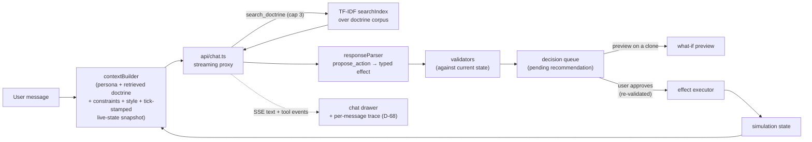
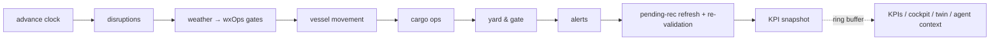

# PortSentinel AI

A resilience-monitoring digital orchestrator for a simulated Tuas mega-port
terminal: live Malacca-Strait weather fused with a deterministic port
simulation, a 3D digital twin, and an agentic AI assistant that reasons over
the live state and proposes interventions — vessel re-routing / re-berthing /
holds, yard re-allocation, and inventory safety-stock advisories. The human
always decides: every proposal (agent-proposed or manual) passes
validation, an adjustable what-if preview, and explicit approval before it
touches the simulation.

- Blueprint and full decision log (D-01..D-73): [plan.md](plan.md)
- Build tracker with per-phase gate evidence: [progress.md](progress.md)
- 6-minute storm-arc walkthrough: [docs/demo-script.md](docs/demo-script.md)

## Running it

```
npm install
npm run dev        # http://localhost:5173
```

AI chat needs `ANTHROPIC_API_KEY=sk-ant-...` in `.env.local` (gitignored);
without it the assistant shows "offline" and the deterministic sim, alerts,
twin and manual move-planning keep working — AI proposals are unavailable
(D-85). Only two external calls exist: Open-Meteo
weather (keyless) and the Anthropic API (via the serverless proxy — the key
never reaches the browser).

```
npm run typecheck  # tsc -b (app + api/)
npx vitest run     # 104 tests: sim determinism/invariants, rules, retrieval,
                   # prompt, trace, twin geometry/presentation/motion
npm run build      # production build; the 3D twin is a lazy chunk
```

## Architecture (D-73)

The codebase is a three-tier layering — documented, not enforced by folder
ceremony (plan.md §12, D-73):

| Tier | Folders | Responsibility |
|------|---------|----------------|
| Presentation | `src/components/`, `src/views/`, `src/twin/` | Dashboard panels, the 5 views, and the react-three-fiber twin. The twin renders exclusively from derived presentation records (`twin/presentation.ts`, D-58) — animation can never contradict the simulation. |
| Domain | `src/sim/`, `src/store/`, `src/utils/`, `src/prompts/` | The deterministic simulation engine (seeded RNG, 9-stage tick, rules, validators, effects, invariants), the Zustand store, the four CLAUDE.md-mandated utils (contextBuilder, responseParser, vesselClassifier, weatherMapper), and the prompt-engineering module (persona, constraints, output style, action logic — D-64/D-65). |
| Data / external | `src/services/`, `api/` | Open-Meteo client, SSE chat client, and the one serverless function `api/chat.ts` (streaming proxy + server-side `search_doctrine` tool loop, D-67). |

### Chatbot response pipeline



Retrieval is field-weighted TF-IDF over a 10-section doctrine corpus with
state-driven forced docs (D-33/D-66) — deliberately no embeddings at this
corpus size; the agent can additionally call `search_doctrine` mid-answer
(D-67) and every retrieval/search/tool-call outcome is visible in the
message's trace disclosure (D-68).

### Simulation tick loop



One seeded PRNG consumed only inside the tick; the same seed reproduces the
identical world (only weather is external, and it is injected as a feed so
determinism tests never draw on it). Provenance (`live_external / simulated /
calculated / ai_generated / user_input`) travels with every displayed value.
