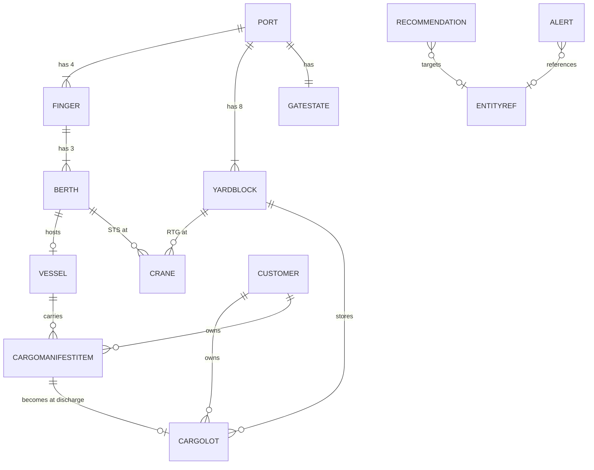

# PortSentinel AI — Technical Blueprint

Living document. Sections are added only after the owner approves them.
Design process: Definition → Requirements → Architecture → Domain Model →
Data Flow → AI Architecture → 3D Twin → Dashboard → Implementation Plan.

Last updated: 2026-07-14

---

## 1. Project Definition — APPROVED 2026-07-10

### Problem statement

Tuas Mega Port operations run on data siloed across weather services, berth
schedules, and yard systems. When a disruption develops — a storm cell in the
Malacca Strait, congestion cascading across berths — the duty manager must
manually correlate these feeds and reason through interventions under time
pressure. PortSentinel AI is a resilience-monitoring digital orchestrator that
fuses live weather and simulated port state into one operational picture, with
an agentic AI assistant that reasons over that state and suggests immediate
interventions — vessel re-routing / re-berthing on the port side, and
inventory safety-stock adjustments for cargo owners whose shipments are
delayed. The human always decides.

### Objectives

1. Agentic chatbot grounded in institutional knowledge (persona, constraints,
   action logic in the system prompt), integrated with a modern LLM API,
   whose recommendations cover both brief-mandated action families:
   immediate re-routing (vessel diversion, re-berthing, yard re-allocation)
   and inventory safety-stock adjustments (advisories for affected cargo).
2. Professional ops dashboard per the approved layout spec
   (`Dashboard Layout.md`), with provenance tags (Live / Simulated / Computed /
   AI-generated) on every displayed value.
3. 3D digital twin of the port as the central overview, driven by the same
   simulation state as the KPIs.
4. Scriptable disruption simulation so demos are controllable and repeatable.
5. Critical reflection on hallucination risk vs. operational agility.

### Target user (persona)

Port operations duty manager at Tuas. Monitors berth/yard status and
approaching weather during a shift; decides berth reassignments, vessel holds,
and escalations. The agent advises; the manager acts.

### In scope

- Web app: React 18 + Vite + TypeScript (strict) + Tailwind CSS v3, per
  `Dashboard Layout.md` (binding).
- Chat drawer with the agentic assistant (LLM provider chosen in Phase 3).
- Live weather for the Malacca Strait / Tuas via a free keyless API
  (candidate: Open-Meteo).
- Simulated port state: berths, vessels, yard blocks, congestion — with a
  demo/scenario panel to inject disruptions.
- 3D digital twin view (fidelity and interactions defined in Phase 7; visual
  baseline: owner's reference image, see Decision D-06).
- KPI row, cockpit gauges, decision/optimizer panel per the layout spec.
- Agent action loop: recommend → user approves in UI → simulation updates.
  Recommendation types: vessel re-routing / re-berthing, yard re-allocation,
  and safety-stock adjustment advisories for at-risk cargo.
- `plan.md`, `progress.md`, `HANDOVER.md` maintained throughout.

### Out of scope

- Real PSA/port data, real AIS vessel feeds, private data integration.
- Authentication, multi-user, roles, persistence beyond the browser session.
- Agent executing actions without explicit user approval.
- Mobile layout (desktop-first ops tool).
- RAG — provisionally out; to be debated in Phase 6.

### Success criteria (mapped to assignment rubric)

- Authenticity (30%): persona-true interactions; realistic berth/vessel/TEU
  semantics; agent recommendations reference actual dashboard state.
- Robustness (30%): API failures degrade gracefully; every panel has explicit
  loading/empty/error/stale states; twin failure cannot break the dashboard;
  demo runs end-to-end with only weather + LLM as external calls.
- UI/UX (20%): layout spec followed exactly; twin readable at a glance;
  provenance always visible.
- Reflection (20%): design decisions and trade-offs logged in this document
  as they are made.

### Decision log

| ID   | Decision | Rationale |
|------|----------|-----------|
| D-01 | Full 3D digital twin is in scope | Owner decision. Risk managed by making the twin a swappable view fed by the same simulation state — if it slips, dashboard + agent stand alone. |
| D-02 | Docs: `plan.md` + `progress.md` + `HANDOVER.md` | Satisfies CLAUDE.md; adds handover doc; single source of truth. |
| D-03 | Persona: port ops duty manager at Tuas | Best fit for the brief's berth-congestion + Malacca-weather framing. |
| D-04 | Data: live weather (keyless API) + simulated port state | Real data for authenticity; simulation for controllable demos. Provenance tags distinguish the two. |
| D-05 | Agent action boundary: recommend → user approves → simulation updates | Human-in-the-loop; more compelling than advisory-only text; no autonomous execution. |
| D-06 | Twin visual direction: stylized low-poly (owner's reference image) | Isometric-style camera; colored container stacks; floating per-block data badges (ID + utilization %, green/amber/red thresholds); quay with STS cranes + vessels; RTG cranes; roads with trucks; view toolbar (select/pan/orbit/layers/fullscreen). Low-poly keeps performance and schedule feasible. |
| D-07 | Timeline: 1 month (from 2026-07-10) | Owner constraint. Twin work must be timeboxed; graded agent/dashboard core takes priority. |

---

## 2. Functional Requirements — APPROVED 2026-07-10

### Feature inventory

- **F1 App shell & navigation** — sidebar, header (status strip + demo/chat/
  dark toggles), toast stack, view router. Fully specified by
  `Dashboard Layout.md`.
- **F2 KPI row** — 7 cards: headline Resilience Score + Berth occupancy %,
  Vessels waiting (count + avg wait h), Yard utilization %, Crane
  availability %, Weather risk index, TEU at risk. Provenance tag on each.
- **F3 Resilience cockpit** — gauge (headline score) + sparkline (trend).
- **F4 3D digital twin** — low-poly port per reference image; orbit/pan/zoom,
  select block/berth/vessel to inspect, layer toggles. Reads the same store
  as the KPIs — never its own data. Dedicated sidebar view AND embedded
  (fixed camera) as the dashboard's xl:col-span-2 overview panel; one
  component, two mounts.
- **F5 Scenario/demo panel** — scripted, repeatable disruptions:
  Malacca Strait storm, vessel arrival surge, crane/equipment breakdown,
  berth closure.
- **F6 Decision queue (optimizer panel)** — recommendation cards for
  immediate re-routing (vessel diversion, re-berthing, yard re-allocation)
  and inventory safety-stock adjustment advisories. Each card: what, why,
  impact estimate, Preview impact, Approve / Dismiss. Approving mutates
  the simulation (D-05) and the UI visibly reacts. Preview (D-50): an
  adjustable what-if panel — simulate ahead with vs without the effect on
  a throwaway state clone, with knobs for alternative valid targets
  (e.g., a different berth) and lookahead horizon (1/2/4 sim-hours).
- **F7 AI chat drawer** — persona-grounded assistant answering questions
  about live state and proposing actions. Agent-proposed actions enter the
  same approval pipeline as F6 (D-12).
- **F8 Live weather** — Malacca Strait + Tuas conditions (wind, gusts,
  precipitation, waves, visibility) via Open-Meteo (D-17). Poll with cached
  last-good values; explicit stale state on outage.
- **F9 Simulation engine** — single source of truth for port state; fixed
  tick + seeded RNG (D-18). Everything downstream (KPIs, twin, agent
  context, rules) reads from it.
- **F10 Provenance system** — one SourceTag component
  (Live / Simulated / Computed / AI-generated) on every displayed value.
- **F11 Alerts & toasts** — threshold breaches (berth >90%, wind over crane
  limits, queue growth) raise alerts; toasts confirm actions.

### Decisions

| ID   | Decision | Rationale |
|------|----------|-----------|
| D-08 | Twin placement: dedicated view + dashboard embed | One component, two mounts; exploration view plus dashboard wow-factor. |
| D-09 | Scenario set: storm, arrival surge, crane breakdown, berth closure | Owner chose all four. Storm exercises live weather + both action families. |
| D-10 | Resilience score: computed by a transparent weighted formula; the AI never generates the score — it only interprets it (contributing factors, trends, risks, recommended actions) | Deterministic + explainable; works with LLM down; clean hallucination-risk boundary for the reflection. |
| D-11 | KPI set: balanced (see F2) | Covers port-side ops and the cargo/safety-stock angle the brief mandates. |
| D-12 | Recommendations: deterministic rules + agent feed ONE queue with one approve/dismiss flow | Rules are the robustness floor (LLM outage never empties the panel); one consistent action pathway. Superseded by D-85. |
| D-50 | Adjustable what-if preview on recommendation cards (added 2026-07-10) | Clone state → run lookahead twice (with/without effect) → diff the 7 KPIs; knobs for alternative targets + horizon. Provenance `calculated`; the real simulation is never touched; raw state is never directly editable in preview. Cost accepted: IP-2 ~4→~6 days, buffer ~4→~2 days. |

---

## 3. System Architecture — APPROVED 2026-07-10

### Shape

Single-page app, no database, no auth (per Phase 1 scope). The only
server-side code is one serverless function proxying LLM calls.

- **Frontend:** React 18 + Vite + TypeScript strict + Tailwind v3
  (binding, per `Dashboard Layout.md`). Charts: Recharts (named by the spec).
- **State:** Zustand store — slices for simulation, weather,
  recommendations, alerts, chat, UI. Selector-based subscriptions keep KPI
  re-renders cheap alongside a 60fps twin; the tick loop writes to the
  store from outside React.
- **Simulation engine:** pure TypeScript module; setInterval tick
  (sim-minutes per real-second ratio decided in Phase 5), seeded RNG for
  repeatable demos; scenario injection = state mutation between ticks.
  Rules engine evaluates state each tick and emits recommendations.
- **3D twin:** react-three-fiber + drei (orbit controls, billboard labels,
  instanced meshes). Lazy-loaded; render failure is contained so the
  dashboard stands alone.
- **Weather:** Open-Meteo weather + marine APIs, keyless, CORS-enabled —
  fetched directly from the browser. Mapped into the domain by a
  `weatherMapper` utility.
- **AI:** Anthropic API, Claude Sonnet, via one Vercel serverless function
  (`/api/chat`) holding the key. Context builder serializes a simulation
  snapshot into the prompt; response parser extracts structured action
  proposals into the decision queue. (Full AI design: Phase 6.)
- **Deployment:** Vercel (SPA + the one function); local dev via
  `vercel dev`.
- Utility modules `vesselClassifier`, `contextBuilder`, `responseParser`,
  `weatherMapper` are intentional architecture (per CLAUDE.md), not
  speculative abstraction. Full file tree: Phase 9.

### Decisions

| ID   | Decision | Rationale |
|------|----------|-----------|
| D-13 | LLM: Claude Sonnet | The agent is the graded core (30% authenticity); best reasoning over state snapshots; cost over a month is a few dollars. |
| D-14 | Deploy: Vercel + serverless proxy | API key never ships to the browser; graders get a URL; runs locally via `vercel dev`. |
| D-15 | 3D: react-three-fiber + drei | Twin renders from the same React state as the KPIs; standard React-18 pairing; instancing + controls for free. |
| D-16 | State: Zustand | Selector granularity for 60fps-adjacent UI; writable from the tick loop outside React; de-facto r3f pairing. |
| D-17 | Weather: Open-Meteo (weather + marine) | Free, keyless, CORS-enabled, marine data for the Strait; zero demo risk. data.gov.sg may be ADDED later if time allows. |
| D-18 | Sim time: fixed tick + seeded RNG | Repeatable, pausable, easy scenario injection; event-driven realism not needed for the demo. |

RAG remains provisionally out of scope — to be debated in Phase 6.

---

## 4. Domain Model — APPROVED 2026-07-10

### Decisions

| ID   | Decision | Rationale |
|------|----------|-----------|
| D-19 | Cargo is modeled as aggregated CargoLots, not individual containers | AMENDED by owner 2026-07-10 (supersedes the earlier individual-container choice). MVP principle: simulate operational decision-making, not physical realism. The twin renders representative instanced stacks generated from aggregated TEU — never one object per container. |
| D-20 | Quay layout: finger piers — 4 fingers × 3 berths | Owner decision — truer to the real Tuas; diverges from the reference image's straight quay (image remains the style baseline for everything else). |
| D-21 | Scale: 12 berths (B1..B12 on F1..F4), 8 yard blocks (YB-A..YB-H) | AMENDED by owner 2026-07-10 (was 6 berths / 2 fingers). Berth/finger IDs are conceptual simulation identifiers only — NOT real PSA numbering. Vessel rotation: see D-27. |
| D-22 | Cranes are first-class entities (STS + RTG) | Needed by the crane-breakdown scenario, the Crane availability KPI, and twin visuals. |
| D-23 | Gate operations are aggregate (GateState), trucks are visual-only | Gate congestion influences resilience/alerts without per-truck simulation. |
| D-24 | Recommendation validation layer: the AI never mutates state directly | Every agent proposal is validated against current simulation state; Approve executes only the validatedEffect. Pipeline: simulation → rules → AI recommendation → validation → user approval → execute. |
| D-25 | Customers are a first-class entity (6–8 fictional consignees) | Enables priority cargo, safety-stock advisories, and customer-specific alerts without implying real commercial data. CargoLot references customerId only. |
| D-26 | Every operational value carries DataProvenance | Domain-level provenance enum feeding the UI SourceTag. `ai_generated` applies ONLY to AI-authored explanations, recommendations, and summaries; the AI must never overwrite or relabel the provenance of underlying operational data (simulation stays `simulated`, formulas `calculated`, weather `live_external`). |
| D-48 | Customer carries lightweight inventory fields (dailyConsumptionTEU, daysOfCoverRemaining, safetyStockDays; seeded, `simulated`) | Safety-stock advisories become computed quantities via OPS-CARGO §4 — fulfils the brief's "inventory safety-stock adjustments" with zero hallucination risk. Approved 2026-07-10. |
| D-49 | Diversions target a real alternate port (AlternatePort static list: Tanjung Pelepas, Port Klang; rough sailing offsets) | `divertVessel` gains `toPortId`; validation checks vessel is approaching/anchored and port exists. On execution the vessel's manifest never discharges → OPS-CARGO rules cascade into safety-stock advisories (the brief's two action families become one causal chain). Only public geography is claimed; doctrine adds "subject to confirmation with the receiving terminal". Approved 2026-07-10. |
| D-27 | Vessel population: ~22, configurable via simulation seed | Baseline distribution: alongside 8–10, anchored 4–6, approaching 4–6, departing 1–3. Hard invariant: never more than 12 vessels alongside (12 berths). Allocation may vary by scenario and seed but must always satisfy berth-capacity constraints, keep the anchorage queue visible, and keep waiting times meaningful. |

### Design principles (owner-mandated)

Single source of truth; no duplicated or derived state stored (derived
values are never stored unless explicitly approved); MVP first; entities
represent operational decision-making, not physical realism; never store
what can be computed; aggregate unless a feature requires individual
traceability; deterministic simulation; performance before unnecessary
realism; clear separation between simulation, computation, and AI
reasoning.

### Entities

```ts
type DataProvenance =
  | "simulated" | "calculated" | "live_external"
  | "static_reference" | "user_input" | "ai_generated";
```

**Spatial**

```ts
type Port = { id: string; name: string; fingerIds: string[];
  yardBlockIds: string[]; gateId: string; anchorageVesselIds: string[] };

type Finger = { id: string; name: "F1"|"F2"|"F3"|"F4"; berthIds: string[] };

type Berth = { id: string; name: string;            // "B1".."B12", conceptual only
  fingerId: string; side: "east"|"west"; lengthM: number;
  status: "available"|"occupied"|"closed"; vesselId?: string;
  craneIds: string[] };                              // STS

type YardBlock = { id: string;                       // "YB-A".."YB-H"
  capacityTEU: number; craneIds: string[] };         // RTG
  // occupiedTEU / utilization are DERIVED from CargoLots — never stored

type Crane = { id: string; kind: "STS"|"RTG"; locationId: string;
  status: "operational"|"degraded"|"down"; downUntilTick?: number };

type GateState = { id: string; processingCapacityPerTick: number;
  queuedTrucks: number; averageWaitMinutes: number;
  status: "normal"|"busy"|"congested"|"closed" };
  // trucks in the twin are visual-only animations driven by this
```

**Cargo & vessels**

```ts
type SizeMix = { twentyFt: number; fortyFt: number };

type CargoManifestItem = { id: string; quantityTEU: number;
  containerCount: number; sizeMix: SizeMix;
  type: "standard"|"reefer"|"hazmat";
  customerId?: string; priority: "normal"|"high" };

type Vessel = { id: string; name: string;
  class: "feeder"|"panamax"|"neopanamax"; lengthM: number;
  status: "approaching"|"anchored"|"berthing"|"alongside"
        | "departing"|"diverted";
  etaTick: number; berthId?: string;
  manifest: CargoManifestItem[];                     // inbound cargo
  loadTEU: number;                                   // outbound (aggregate)
  workProgress: number };                            // 0–1 while alongside
  // delayHours DERIVED from etaTick vs clock

type CargoLot = { id: string; quantityTEU: number; containerCount: number;
  sizeMix: SizeMix; blockId?: string; slotRegion?: string;
  type: "standard"|"reefer"|"hazmat";
  status: "discharging"|"yard"|"outbound"|"delivered";
  arrivalTick: number; customerId?: string;
  priority: "normal"|"high"; dwellStartTick?: number };

type Customer = { id: string; name: string;          // 6–8 fictional
  sector: "healthcare"|"food"|"electronics"|"automotive"
        | "industrial"|"retail";
  temperatureSensitive: boolean; defaultPriority: "normal"|"high";
  dailyConsumptionTEU: number;                       // D-48: seeded,
  daysOfCoverRemaining: number;                      // simulated provenance —
  safetyStockDays: number };                         // quantifies advisories

type AlternatePort = { id: string; name: string;     // D-49: static_reference
  extraSailingHours: number; note: string };         // real regional ports
  // (Tanjung Pelepas, Port Klang); public geography only — no operational
  // claims about those terminals
```

Cargo lifecycle: `CargoManifestItem` (on inbound vessel) → discharge →
`CargoLot` created → yard allocation → storage → outbound → delivered.
No inactive cargo records exist while a vessel is still approaching.

**Environment & events**

```ts
type WeatherState = { asOf: string; windKts: number; gustKts: number;
  windDirDeg: number; waveHeightM: number; visibilityKm: number;
  precipMm: number; freshness: "live"|"stale";
  provenance: DataProvenance };                      // "live_external"
  // riskIndex (0–100) is CALCULATED by the resilience formula inputs

type Disruption = { id: string;
  type: "storm"|"arrivalSurge"|"craneFailure"|"berthClosure";
  targetIds: string[]; startTick: number; durationTicks: number;
  severity: 1|2|3 };
  // active is COMPUTED from clock.tick vs startTick+durationTicks

type EntityRef = { entityType: "vessel"|"berth"|"yardBlock"|"crane"
        | "gate"|"cargoLot"|"customer"; entityId: string };

type Alert = { id: string; severity: "info"|"warning"|"critical";
  message: string; entityRef?: EntityRef; tick: number;
  acknowledged: boolean; provenance: DataProvenance };
```

**Decisions & AI**

```ts
type SimulationEffect =                              // typed union, exhaustive
  | { kind: "reassignBerth"; vesselId: string; toBerthId: string }
  | { kind: "divertVessel"; vesselId: string; toPortId: string }  // D-49
  | { kind: "holdVessel"; vesselId: string; untilTick: number }
  | { kind: "reallocateYard"; lotIds: string[]; toBlockId: string }
  | { kind: "closeBerth"; berthId: string }
  | { kind: "safetyStockAdvisory"; customerId: string; note: string };

type RecommendationImpact = { waitHoursSaved?: number;
  teuProtected?: number; utilizationDeltaPct?: number };  // typed, no Record<string,any>

type Recommendation = { id: string; source: "rule"|"agent";
  type: "reroute"|"reberth"|"yardRealloc"|"safetyStock";
  title: string; rationale: string; impact: RecommendationImpact;
  proposedEffect: SimulationEffect;
  validationStatus: "pending"|"valid"|"invalid";
  validatedEffect?: SimulationEffect;                // ONLY this is executable
  validationMessage?: string;
  status: "pending"|"approved"|"dismissed";
  createdTick: number; provenance: DataProvenance };

type ChatMessage = { id: string; role: "user"|"assistant"|"system";
  content: string; proposedRecommendationIds: string[];
  timestamp: string };
```

Recommendation lifecycle (D-24, amended by D-85 — the rule engine stage was
removed): simulation → AI recommendation (propose_action) or user proposal →
validation against current state → user approval →
execute `validatedEffect` → simulation. The Approve button never executes
`proposedEffect`.

**Time & metrics**

```ts
type SimulationClock = { tick: number; simTime: string; seed: number;
  speed: 0.5|1|2|4|8; running: boolean };

type KpiSnapshot = {                                 // ring buffer; feeds sparklines
  tick: number;
  resilienceScore: number;                           // calculated (D-10)
  berthOccupancyPct: number;
  vesselsWaiting: number;
  averageBerthWaitHours: number;
  yardUtilisationPct: number;
  craneAvailabilityPct: number;
  weatherRiskIndex: number;
  teuAtRisk: number };
```

KpiSnapshot fields exactly match the approved 7-card dashboard (D-11);
`vesselsWaiting` + `averageBerthWaitHours` share one card. Gate metrics
(queue, wait) are resilience-formula inputs read from GateState — not
duplicated into the snapshot.

### Entity relationships (ERD)



Provenance mapping to the UI SourceTag (spec variants):
`live_external` → Live; `simulated` / `static_reference` → Simulated;
`calculated` → Computed; `ai_generated` → AI-generated;
`user_input` → not displayed (user's own actions).

---

## 5. Data Flow — APPROVED 2026-07-10

### Simulation tick pipeline

One tick = one deterministic pass in fixed stage order:

```
1. Advance clock            tick++, simTime += 5 sim-minutes
2. Disruption transitions   activate/expire from startTick + durationTicks
3. Weather application      latest WeatherState → operational limits
                            (e.g., gusts above STS limit pause crane work)
4. Vessel movement          approaching→anchored→berthing→alongside→
                            departing; berth assignment from anchorage queue
5. Cargo operations         workProgress advances; CargoManifestItem →
                            CargoLot on discharge; outbound loading
6. Yard & gate update       lot allocation; GateState queue/wait/status
7. Alert evaluation         threshold rules over the fresh state
8. Pending-rec refresh      (amended by D-85: rule generation removed)
                            D-56 safety-stock freshness; re-validate all
                            pending recommendations against the new state
9. KPI snapshot             compute the 7 KPIs + resilience score → ring
                            buffer (~120 entries, feeds sparklines)
```

Determinism: one seeded PRNG (mulberry32-class), consumed only inside the
tick in stage order. No `Math.random()` or `Date.now()` inside simulation
logic; wall-clock exists only outside the engine (weather polling, chat).
Future events (ETAs, crane repairs) are stored as tick numbers, not timers.

### World generation (D-32)

All operational data is generated from the seed at simulation start:
22 vessels (D-27 distribution) with fictional names and class-realistic
manifest ranges; yard blocks pre-filled to varied utilizations; the static
customer list (`static_reference`); cranes and gate at baseline. Same seed →
identical world. Only weather is external. Realism comes from public-
knowledge generator constants, never from real PSA/AIS data.

### Weather integration

Poll Open-Meteo (weather + marine, two fixed points: Tuas, mid-Strait)
every 10 min; `weatherMapper` → `WeatherState` (`live_external`). Stale
after 30 min without success (3 consecutive failures); last-good values
retained and labeled stale. If no fetch has ever succeeded, the engine
generates plausible weather with provenance `simulated` — never shown as
Live. The storm scenario ALWAYS applies a `simulated` severe-weather
overlay (demo never depends on real storms); the UI shows the overlay
explicitly.

### Agent context snapshot

Built by `contextBuilder` at message-send time, stamped with the tick:
current KpiSnapshot + ~1-sim-hour trend deltas; berth table (12 rows) and
anchorage queue; active disruptions; current weather with freshness;
gate state; per-block yard utilization; top at-risk cargo (priority lots +
customers, capped list — never raw lot dumps); pending recommendations.
Provenance is preserved textually — sections labeled `[simulated]`,
`[live_external — as of HH:MM]`, `[calculated]` — enabling honest source
attribution. Document retrieval: deferred to Phase 6; the prompt structure
reserves a static institutional-knowledge slot.

### Recommendation pipeline

(amended by D-85) simulation → AI recommendation (propose_action) or user
proposal → validation →
user approval → execute → simulation update. The AI only proposes.
Double validation: at creation (produces `validatedEffect` or `invalid` +
message) and again at approval click; only approval-time validation
authorizes execution.

### Effect execution

Executor accepts only `validatedEffect` (exhaustive switch over the typed
`SimulationEffect` union). Atomic per effect: re-validate → apply →
invariant check. Failed approval-time validation = no-op; recommendation
flips to `invalid` with message; toast explains. Nothing partial applies.

### What-if preview execution (D-50)

Preview = pure function of current state: deep-clone the simulation
state, run the tick pipeline N ticks ahead twice (with the candidate
effect applied / without), diff the resulting KpiSnapshots, render
deltas with `calculated` provenance. Adjustable inputs: the effect's
target (restricted to values that pass validation, e.g., other suitable
berths) and horizon (12/24/48 ticks = 1/2/4 sim-hours). The clone uses a
forked RNG so the live simulation's determinism is untouched; previews
never write to the store; direct raw-state editing is not exposed.

### State consistency invariants

`assertInvariants(state)` after every tick and effect execution — throws
in dev, logs + raises a critical Alert in production:

- Berth: ≤1 vessel per berth; `berth.vesselId` ↔ `vessel.berthId` mutually
  consistent; ≤12 alongside; closed berths host no vessel.
- Yard: Σ lot TEU per block ≤ capacityTEU; yard-status lots have blockId.
- Vessels: exactly one status; anchored ⇔ in anchorage queue; diverted
  vessels have no berth.
- Cargo: TEU conservation vs manifest; statuses only move forward.
- Weather: `asOf` never regresses; freshness follows the threshold rule.
- Disruptions: activity always computed from the clock, never stored.
- Recommendations: approved ⇒ validatedEffect existed at execution;
  executed recommendations are never re-executable.

### Decisions

| ID   | Decision | Rationale |
|------|----------|-----------|
| D-28 | Tick cadence: 1 tick = 5 sim-min, every 2 real seconds; speed 0.5–8× scales the interval | Sim-hour ≈ 24 real seconds; full disruption arc fits a 2–3 minute demo. |
| D-29 | Approved effects execute immediately between ticks, after re-validation | Instant UI/twin feedback; works while paused; JS single-threading makes between-tick atomicity free. |
| D-30 | No rollback in MVP | Double validation makes execution all-or-nothing; scenario reset (re-seed) covers recovery. |
| D-31 | Weather: poll 10 min, stale after 30 min | Upstream updates ~hourly; 3-failure threshold avoids UI flapping. |
| D-32 | Seeded world generator; only weather is external | Repeatable demos; honest simulated/live provenance split. |

---

## 6. AI Architecture — APPROVED 2026-07-10

### System prompt structure (assembled per request by contextBuilder)

```
1. Persona                who the agent is, tone, scope
2. Institutional          retrieved doctrine sections + always-on doc index
   knowledge
3. Constraints            hard behavioural rules
4. Action logic           when/how to propose recommendations
5. Live state             tick-stamped snapshot (per §5)
6. Pending recs           so the agent never duplicates the queue
```

Conversation history rides in the messages array (sliding window, last
~12 messages); the snapshot lives in the system prompt so history stays
pure dialogue and never accumulates stale state.

### Persona (approved)

"You are PortSentinel, the operations assistant for the duty manager at
Tuas Mega Port Terminal T1 (simulated). You speak like an experienced ops
officer: concise, factual, action-oriented. You quantify claims from the
provided state, never from memory. You are an advisor — you have no
authority to execute anything."

### Constraints (approved)

- Only cite the provided snapshot; if data isn't in context, say so —
  never estimate from world knowledge.
- Attribute provenance when quoting values ("gusts 38 kt — live, as of
  14:20"; "YB-C 92% — simulated").
- Never claim an action was executed; actions happen only through user
  approval.
- Never invent vessels, berths, customers, or numbers. Never present
  simulated data as real. Decline out-of-domain requests.

### Action logic (approved)

Propose a recommendation (via tool call) only when (a) doctrine thresholds
are breached or trending toward breach, (b) the action maps to a defined
SimulationEffect kind, and (c) no equivalent pending recommendation
exists. Rationale must reference specific state values; include an impact
estimate. Advisory answers needing no action stay plain text.

### Doctrine corpus (approved numbers — also simulation behaviour)

Single source of truth: `doctrine.ts` exports constants (imported by the
rule engine and validators) AND corpus sections as template strings
interpolating those constants — drift is impossible (D-37).

Sections: `{ docId, sectionId, title, keywords[], body }` — 7 docs:

- **OPS-CRANE** — §1 STS suspends at gusts ≥35 kt (resume after 15 min
  below); RTG ≥45 kt. §2 Degraded = 50% productivity. §3 Breakdown:
  redistribute within berth; if berth productivity <50%, consider
  re-berthing.
- **OPS-BERTH** — §1 Neopanamax on B1–B6 only (F1/F2 deep water);
  others any berth. §2 Queue priority: hazmat > reefer > longest delay;
  tie → earliest ETA. §3 Re-berth when expected wait reduction ≥4 h or
  safety requires. §4 Target max anchorage wait 12 h. §5 Diversions name
  an alternate port from the approved list; always subject to
  confirmation with the receiving terminal.
- **OPS-YARD** — §1 Bands: <70% normal · 70–85% elevated · >85%
  re-allocation review · >92% critical (stop inbound allocation).
  §2 Reefer only in powered YB-A/YB-B. §3 Hazmat segregated to YB-H.
  §4 Re-allocate lowest-priority, longest-dwell lots first.
- **OPS-WX** — §1 Risk bands: 0–30 normal · 31–60 caution (slow
  approaches) · 61–80 severe (no feeder berthing moves) · 81–100 critical
  (all vessel moves suspended). §2 At severe+, advise diversion for
  approaching vessels >8 h out. §3 Stale weather = degraded confidence,
  advisories must say so.
- **OPS-CARGO** — §1 High priority = customer defaultPriority high OR
  temperatureSensitive. §2 Safety-stock advisory when a high-priority
  customer's cargo is delayed >24 h. §3 Dwell: flag >5 days, escalate >8.
  §4 Safety-stock adjustment (D-48): if expected cargo delay (days)
  exceeds the customer's daysOfCoverRemaining, recommend raising
  safetyStockDays by the shortfall, rounded up — a `calculated` quantity,
  never an AI estimate.
- **OPS-SCORE** — §1 resilience = 100 − Σ weighted stress: queue & wait
  25% · crane availability 20% · berth occupancy stress 15% · yard
  utilization 15% · weather risk 15% · gate congestion 10%. §2 Score is
  `calculated`; the agent explains contributions, never adjusts it.
- **OPS-ESC** — §1 Resilience ≥70 normal · 40–69 heightened monitoring ·
  <40 inform terminal management. §2 The assistant recommends escalation;
  humans perform it.

### Retrieval mechanics (D-33 — mechanics amended by D-66/D-67, see §12)

Score sections by keyword hits against the user message PLUS automatic
boosts from simulation context (active storm → OPS-WX; craneFailure →
OPS-CRANE; berthClosure/surge → OPS-BERTH; etc.). Include top 3 sections
above a minimum score + disruption-forced docs. A one-line index of all
doc titles is always present. Agent cites sections inline as
`[OPS-YARD §2]`; chat UI renders citations as chips.

### Degradation

LLM failure/timeout → chat shows the spec's error state with retry. (Amended
by D-85: with the rule engine removed, an LLM outage means the queue fills
only from user-initiated moves — the deterministic sim, alerts, twin and
manual planning keep running.) One automatic retry on transport errors.

### Decisions

| ID   | Decision | Rationale |
|------|----------|-----------|
| D-33 | Institutional knowledge via lightweight topic retrieval (keyword + context boosts), no embeddings | Demonstrates a retrieval pipeline without embedding infra; disruption boosts make doctrine follow the situation. |
| D-34 | Agent proposes actions via Claude tool calling (schema mirrors SimulationEffect) | API-enforced schema; typed input to responseParser; malformed proposals near-impossible. |
| D-35 | Conversation memory: sliding window (~12 messages) + fresh snapshot in system prompt each request | Bounded cost/latency; state never goes stale in history. |
| D-36 | Streaming responses (SSE through the Vercel function) | Sonnet latency hidden; expected chat UX. |
| D-37 | Doctrine single source: `doctrine.ts` constants + interpolated corpus sections | Rule engine, validators, and agent share exactly one truth; no drift. |
| D-51 | Doctrine operational thresholds recalibrated to the compressed sim clock (amends D-10 numbers), added 2026-07-10 during IP-2 | Running the storm arc showed the real-world-hour thresholds (divert >8h out, wait >12h, delay >24h) are never reached at 5 sim-min/tick with fast vessel cycling, so reroute + safety-stock recs never fired. New values: anchorage-wait trigger 12h→4h, high-priority delay 24h→4h, weather-divert drops the ">8h out" lead (fires for any approaching vessel in severe+ weather), storm duration 40→60 ticks so congestion builds. The compressed-clock rationale is documented for the reflection (it is itself a hallucination-vs-agility trade-off: thresholds tuned for demonstrability). The doctrine STRUCTURE and the score formula (D-10) are unchanged. |

---

## 7. 3D Digital Twin — APPROVED 2026-07-10

### Scene layout (plan view)

Water/basin north with the anchorage NE (anchored vessels visibly queue).
Four fingers F1–F4, each with three berths: two on the west face, one on
the east face (B1–B3 = F1 … B10–B12 = F4). Doctrine mapping: B1–B6 =
F1/F2 deep-water (neopanamax). Quay apron road along the finger bases
with STS cranes. Two rows of four yard blocks: YB-A/YB-B (reefer-powered)
nearest the quay, YB-H (hazmat, segregated) far corner. Internal road
grid with visual trucks. Gate complex SW; decorative warehouses south.
Style: owner's reference image — low-poly, colored container stacks,
dark billboard badges.

### Visual data encodings

Block badges: dark billboard, ID + utilization %, colored at doctrine
bands (<70 green, 70–85 amber-ish, >85/92 red — matching OPS-YARD §1).
Berth status: quay-edge color strip. Down crane: red + motionless.
Closed berth: hatching. Vessel color by status. Heatmap layer toggle
re-tints blocks by utilization. All colors from the layout spec's chart
hex palette so twin and dashboard agree.

### Interactions

Click selects vessel / berth / block / crane → inspector panel: entity
state, related pending recommendations, and an "Ask PortSentinel about
this" button that pre-fills the chat drawer. Hover = subtle highlight.
Toolbar (per reference image): select, pan, orbit, layers, fullscreen,
reset view. Layer toggles: labels, cranes, trucks, heatmap. Selection
lives in the Zustand store so other panels can react.

### Camera

Clamped OrbitControls (no under-ground, min/max zoom, pan bounds).
Four presets: Overview / Quay / Yard / Gate. Double-click an entity →
focus tween. Initial view matches the reference image angle.

### Performance budget

Instanced meshes for containers (≤ ~6k boxes; one draw call per cargo
color). Target 60 fps desktop; DPR cap 2 (1.5 embed); < 150 draw calls.
Twin lazy-loaded as its own chunk; rendering paused when tab hidden or
view unmounted; error boundary contains any crash (dashboard unaffected,
per D-01).

### Decisions

| ID   | Decision | Rationale |
|------|----------|-----------|
| D-38 | Animations: moderate — state-driven only | Vessels glide along paths; working STS gantries/trolleys move; truck density mirrors GateState; stacks grow/shrink on discharge. Every motion means something; no choreography for its own sake. |
| D-39 | Labels: permanent block badges; hover/selection labels for vessels, berths, cranes | Reference-image look without a label cloud at overview zoom. |
| D-40 | Weather in twin: ambient — lighting dims by risk band, rain streaks at severe+ | The storm scenario reads visually at minimal GPU/tuning cost. |
| D-41 | Dashboard embed: non-interactive slow auto-orbit at 1.5 DPR; click navigates to the full view | Living overview that never steals scroll/drag; one canvas component with an `embed` prop. |

---

## 8. Dashboard — APPROVED 2026-07-10

Five sidebar views (About was proposed and removed by owner). The
sidebar footer's muted status line carries the "simulated data —
fictional identifiers" disclaimer. Floating layers (all views): chat
drawer (right), demo panel = simulation transport (play/pause, speed
0.5–8×, seed, reset, tick/sim-time), toast stack. Header status strip:
sim clock + tick, weather freshness dot, LLM health dot, alert bell
(popover: last ~10 alerts, unacknowledged badge, acknowledge, "view all"
→ Alerts view), demo/chat/dark toggles.

### View 1 — Resilience Monitor (main)

Spec's three rows in `max-w-7xl`:
1. KPI row — the 7 approved cards: label, big value, detail line (trend
   arrow + delta vs ~1 sim-hour via ring buffer), SourceTag. Resilience
   card first, colored by OPS-ESC band.
2. Feature row — Cockpit (1 col): gauge (0–100, bands 40/70), sparkline
   (~2 sim-hours), "Interpret" button → one streamed AI paragraph under
   the gauge with AI-generated tag (D-42). Overview (2 cols): twin embed
   (D-41) + legend strip + "Open Digital Twin".
3. Controls row — Scenario panel: 4 disruption buttons + severity (1–3)
   + active disruptions with remaining sim-time. Decision queue panel:
   recommendation cards (pending first; rule/agent badge; validation
   state; impact; Approve/Dismiss).

### View 2 — Digital Twin

Full-height canvas under the header. Overlays: toolbar (select/pan/
orbit/layers/fullscreen/reset), camera presets, legend toggle. Selection
docks the inspector panel (entity state, related recommendations,
"Ask PortSentinel about this"). Lazy-chunk loading state; error-boundary
fallback with retry.

### View 3 — Operations

Berth board (12 tiles: status strip, vessel, work-progress) full-width;
Anchorage queue (vessel, class, hours waited, OPS-BERTH priority) beside
Vessel table (~22, status-filterable); Yard blocks (8 doctrine-banded
utilization bars) beside Cargo at risk (priority lots: customer, TEU,
delay vs 24 h threshold).

### View 4 — Weather

Current-conditions panels for Tuas and mid-Strait (Live tags + as-of),
weather risk gauge with OPS-WX band annotations, doctrine reference
card, 24 h hourly forecast line chart (Recharts; same free Open-Meteo
call, extra mapper path).

### View 5 — Alerts

Filterable history table: severity, message, linked entity (click
navigates), sim-time, acknowledged. Filters: severity, entity type;
acknowledge-all. Same store as the bell popover.

### Decisions

| ID   | Decision | Rationale |
|------|----------|-----------|
| D-42 | AI score interpretation: inline in cockpit, on demand | D-10's hybrid visible on the primary page; no auto-firing LLM calls. |
| D-43 | Alert history: bell popover (recent) + dedicated Alerts view (full log) | Owner chose both; popover for triage anywhere, view for audit. |
| D-44 | Demo panel = simulation transport; scenario injection lives on the dashboard | Reconciles the spec's floating demo panel with its controls-row scenario panel. |

---

## 9. Implementation Plan — APPROVED 2026-07-10

Deadline: 2026-08-10 (D-47). ~29 working days planned, ~2 days buffer
(D-50 accepted the reduction) — the buffer belongs to the twin. Build order protects the graded core:
by end of IP-4 the app is submittable without the twin (D-01, D-45).
Gate rule (CLAUDE.md): a phase does not start until the previous phase's
gate is verified.

### Build phases

**IP-0 — Scaffold (~1 day).** Vite + React 18 + TS strict + Tailwind v3;
app shell (sidebar, header, dark mode, 5 view stubs, toast stack);
primitives Panel / PanelState / KpiCard / SourceTag.
*Gate:* app runs, all views navigable, dark mode works, zero console
errors.

**IP-1 — Domain + simulation engine (~4 days).** Entity types,
doctrine.ts, seeded PRNG, world generator, tick pipeline (weather stage
stubbed), rule engine + validators + effect executor, invariants,
Zustand slices, transport panel.
*Gate:* Vitest passes — same seed ⇒ identical state after N ticks;
invariants hold over 10,000 ticks; D-27 population distribution holds.
Debug readout shows the world evolving.

**IP-2 — Dashboard core (~6 days).** KPI row, cockpit (gauge, sparkline,
resilience formula), scenario panel, decision queue, alerts (toasts +
bell popover), adjustable what-if preview (D-50).
*Gate:* full arc with NO AI and NO twin — inject storm → alerts → rule
recommendations → preview shows with/without deltas (real state
untouched) → approve → KPIs visibly react.

**IP-3 — Weather (~2 days).** Open-Meteo client, weatherMapper,
polling/freshness/fallback, weather tick stage, Weather view + forecast
chart.
*Gate:* live data with as-of time; network kill → correct stale
labeling; offline start → simulated fallback, never fake Live.

**IP-4 — AI agent (~5 days).** api/chat.ts (streaming), contextBuilder,
doctrine retrieval, tool schema + responseParser, vesselClassifier,
chat drawer (streaming, citation chips, action cards),
agent→validation→queue integration, cockpit Interpret.
*Gate:* grounded answers with doctrine citations + provenance
attribution; agent proposes a valid re-berth that survives validation;
LLM-down degradation leaves the queue alive.

**IP-5 — 3D digital twin (~7 days).** Scene per §7, instanced
containers, badges, selection + inspector, camera presets, moderate
animations, ambient weather, embed mode, performance pass.
*Gate:* 60 fps desktop; click-inspect-ask loop works; error boundary
contains a forced crash.

**IP-6 — Operations + Alerts views (~2 days).**
*Gate:* every panel shows correct loading/empty/error/stale states.

**IP-7 — Deploy + hardening + demo script (~2 days).** Vercel deploy,
env config, full-state QA pass, README + demo script (scripted storm
arc), reflection notes.
*Gate:* the deployed URL runs the complete demo end-to-end.

### File structure (binding — CLAUDE.md exception applies)

```
api/chat.ts                     Vercel serverless function (streaming)
src/
  App.tsx, main.tsx             shell, router
  components/                   Panel, PanelState, KpiCard, SourceTag,
                                Gauge, Sparkline, toasts, drawer, ...
  views/                        ResilienceMonitor, DigitalTwin,
                                Operations, Weather, Alerts
  twin/                         r3f scene, entities, instancing, badges,
                                camera, inspector
  sim/                          types, doctrine, rng, worldGen, tick,
                                rules, validators, effects, invariants,
                                resilience
  store/                        Zustand slices
  services/                     weatherClient, chatClient
  utils/                        vesselClassifier, contextBuilder,
                                responseParser, weatherMapper
  prompts/                      persona, constraints, actionLogic,
                                style, index        (added by D-64)
  maritime/                     ports, network, graph, geofence,
                                routeEngine, populationGen, selectors,
                                clustering, scenario, map/, dev/,
                                data/SOURCES.md     (added by §14 GR)
```

The four utils are the CLAUDE.md-mandated modules (as .ts).
Structure amended by D-64 (2026-07-14): `src/prompts/` added.
Structure amended by §14 (2026-07-19): `src/maritime/` added — the
geographic plane (static reference network + map presentation); the
operational plane stays in `sim/`.

### Decisions

| ID   | Decision | Rationale |
|------|----------|-----------|
| D-45 | Build order: AI agent (IP-4) before twin (IP-5) | The agent is ~60% of the grade and lands by ~day 16 with buffer behind it; the twin's overrun eats buffer, not the core. |
| D-46 | Testing: Vitest on the sim core only (determinism, invariants, world-gen, rules, validators, effects, resilience, retrieval, responseParser); UI verified manually per gate | Best robustness-per-hour; silent-failure logic gets the harness, demo-visible UI gets the demo. |
| D-47 | Deadline: 2026-08-10 | Owner confirmed; plan leaves ~4 days buffer. |

---

*Design complete — 49 recorded decisions. Implementation begins only on
explicit owner instruction, starting at IP-0.*

---

## 10. Integrated Weather / Twin / Decision-Support Design — Phase 1 (in progress)

Phase 0 repository audit approved 2026-07-11 (baseline: build clean, 23/23
tests pass; findings recorded in the audit report). Decisions below are
approved one at a time; implementation starts only after the full Phase 1
target design and Phase 2 delivery breakdown are approved.

| ID   | Decision | Rationale |
|------|----------|-----------|
| D-52 | Canonical weather-band model: two-layer split. `doctrine.ts` gains the canonical band array `{ id: "normal"\|"caution"\|"severe"\|"critical", minInclusive, maxInclusive, label, operationalMeaning }` derived from the existing `DOCTRINE.weather` thresholds (0–30/31–60/61–80/81–100), plus one exported `weatherRiskBand(risk)` lookup; OPS-WX corpus text interpolates from it (D-37 pattern). Band→colour mapping (hex + Tailwind tokens) lives once in the shared palette module (extending `src/twin/colors.ts`, which already aligns twin and dashboard hexes). Approved 2026-07-11. | Issues 1/3/6 all consume one band concept. Keeps rendering separate from business logic (owner rule) while retaining exactly one definition per concern. Consequences: `Gauge` becomes semantics-free (colour passed as a prop — fixes the inverted weather gauge); `Header.weatherDot`, `Weather.tsx` BANDS, twin `SkyLight`/`Rain` literals (`> 60`), and `contextBuilder.weatherLine` (gains the band label) all consume `weatherRiskBand()` + the palette map; the one-off `#e07b39` Severe orange is reconciled to the palette. Test implications: boundary-value unit tests (30/31/60/61/80/81) + a consistency test that gauge, band bar, and header derive from the same band. |
| D-53 | Weather ↔ Twin UI relationship: separate pages with shared state (Option A). Weather stays a dedicated view; the twin keeps consuming the same store weather state; weather/crane alerts gain `entityRef`s and reuse the existing alert→twin focus mechanism (shipped in IP-6) so a weather alert can be clicked to select the affected asset in 3D. A compact in-twin weather drawer (Option B) is explicitly deferred to the Digital-Twin delivery phase and reconsidered there once suspended/held asset states exist to display. Approved 2026-07-11. | Least new surface; ~70% of plumbing already exists (one store, alert→twin navigation with selection); zero rework of the approved 5-view layout (D-08). Consequences: STS/weather alerts in `tick.ts` must carry entityRefs; the invariants hold — one weather state, one band model (D-52), one rule path, no cosmetic overlays. Test implications: alert-generation tests assert entityRefs on weather alerts. |
| D-54 | Weather-effects matrix + pause/recovery state machine. W1: STS work frozen at gusts ≥35 kt (existing), resume only after 3 consecutive ticks (15 sim-min) below — new. W2: RTG suspended at gusts ≥45 kt — yard→gate outflow 0, discharge cannot place lots; 3-tick recovery. W3: visibility < 3 km (new `DOCTRINE.weather.visMinKm`, calibrated so sev-3 storms — which converge to 2.5 km — can trigger it; D-51 precedent) suspends arrivals, berth assignment, and freezes berthing/departing phase timers. W4: severe band (61–80 via D-52) — `assignBerths` skips feeders. W5: critical band (81–100) — no berthing/unberthing moves, STS+RTG suspended regardless of gusts; **approaching vessels may still anchor** (owner ruling: anchoring is the safe move; keeps divert-vs-anchor meaningful). W-caution: **mechanical slowdown** (owner ruling) — approaching vessels' `etaTick` slips +1 per 3 consecutive ticks in caution, via deterministic counter. W6: wind/precip/wave gate nothing directly — risk-index only. W7: stale feed holds current suspensions, triggers no new ones; alerts/recs/chatbot say "degraded confidence". W8: storm scenario uses no special path — overlay values drive W1–W5 through the same thresholds. State: one `SimState.wxOps` counter block (sts/rtg/move clear-tick counters + caution counter); suspend instantly, resume slow (anti-flap); frozen ops shift `phaseEndsTick`/hold `workProgress` so nothing progresses invisibly. KPIs: weather-suspended cranes count unavailable in `craneAvailabilityPct` (accepted mild double-count with the 15% weather term — operationally truthful). Suspension AND resumption raise alerts with entityRefs (D-53). OPS-CRANE/OPS-WX corpus interpolates the new constants (D-37). Approved 2026-07-11. | Doctrine currently promises consequences the sim never performs (audit §4 — only STS gusts implemented; the critical-band alert claims suspensions that don't happen). One rule path, deterministic, RNG-free (preview-safe). Test implications: per-row trigger tests, 3-tick recovery/anti-flap tests, frozen-progress tests (paused ops don't advance), caution ETA-slip determinism, KPI/alert consistency, stale-holds-state test. |
| D-55 | Rerouting & holding: refactor the existing rule pipeline (no second engine). Two shared deterministic helpers in `sim/`: `projectedBerthWaitHours(state, vessel)` (class-aware — berth-free estimates from workProgress/remaining TEU/craneUnitsAtBerth + doctrine-ordered queue ahead + remaining weather-suspension ticks; provenance `calculated`) and `pickAlternatePort(state, vessel)` (lowest extraSailingHours among ports without a pending/recent diversion — spreads across PTP/Klang; tie → fewer pending, then list order). Weather response (band ≥ severe, replaces `weatherDivertRule`): per approaching vessel in etaTick order (cap 3 live proposals) — divert via pickAlternatePort when projected wait > extra sailing (waitHoursSaved = difference), else hold until `tick + remainingDisruptionTicks + 3`. Congestion response (evolves `longWaitRule`): existing trigger, but divert only when projected wait > extra sailing; plus congestion-hold — when ≥ 6 vessels wait at anchorage, hold the nearest approaching vessel. Every rationale states vessel, action, destination, projected wait, extra sailing, net benefit, doctrine section, and the receiving-terminal confirmation caveat; safety- vs congestion-driven is explicit. OPS-BERTH §3/§5 corpus interpolates the comparison rule (D-37). Agent parity (owner ruling): `propose_action` gains `holdVessel` (future-tick validated by the existing validator); `closeBerth` stays excluded. Validators, preview, queue, and executor unchanged. Approved 2026-07-11. | Audit §5: selection was first-match (first vessel, always port[0]), no wait-vs-sail comparison, holdVessel unproposable by anything. Rejected alternatives: minimal spreading-only fix (leaves holdVessel dead), full TEU-weighted cost model (overkill for 2 ports, violates simplicity-first). Test implications: reasoned-selection tests, port-spreading test, wait-vs-sail comparison both directions, hold-at-critical-weather test, congestion-hold trigger, agent holdVessel round-trip, preview purity unchanged. |
| D-56 | Safety-stock response contract. (1) One shared calculation `safetyStockShortfallDays(state, customerId)` in `sim/derive.ts`: `max(1, ceil(expectedDelayDays − daysOfCoverRemaining))`, where expectedDelayDays = **maximum** delay across the customer's delayed vessels (owner ruling — cover must survive the worst shipment). (2) Typed quantity: `safetyStockAdvisory` effect becomes `{ customerId, days: number, note? }`; validator requires customer exists AND integer days ≥ 1; executor applies `effect.days` to both safetyStockDays and daysOfCoverRemaining — the hard-coded +2 (audit: effects.ts:66 vs rules.ts:82 mismatch) is removed. (3) Freshness: the per-tick re-validation loop additionally refreshes pending safety-stock recs — recompute shortfall, update effect.days + rationale in place; displayed = executed always; approval-time re-validation stays as backstop. (4) Hallucination boundary: agent tool keeps customerId only — the parser computes days via the shared function; the LLM can never author the quantity (OPS-CARGO §4 structurally enforced). (5) Chatbot: contextBuilder gains a `[calculated]` safety-stock block per affected high-priority customer (name, affected TEU, days of cover, expected delay, computed shortfall, pending-rec status) + a constraint to present these fields in the structured advisory form with provenance labels, never buried in a paragraph. Approved 2026-07-11. | Fixes the confirmed displayed≠executed bug and the stale-pending hazard in one contract; the quantity has exactly one author (the shared function). Test implications: shortfall edge cases (delay < cover, fractional days, multi-vessel max aggregation), displayed-equals-executed round-trip, invalid days rejected, pending-refresh-on-delay-change, agent parity (parser-computed days), context block contains all required calculated fields. |
| D-57 | Render-crash control: production-visible as "Test 3D recovery" (Issue-2 Option 4). The existing dev-only Bug button (Toolbar.tsx `import.meta.env.DEV` gate) is relabelled with a friendlier icon and tooltip ("Simulates a 3D failure to demonstrate contained recovery — the dashboard is unaffected") and the DEV gate is removed. Mechanism unchanged: `<Boom/>` throws in the R3F tree → TwinErrorBoundary fallback → Retry remounts cleanly. The error boundary itself is untouched and must never be removed with the trigger. Approved 2026-07-11. | Robustness is 30% of the rubric and graders judge the deployed URL, where the crash test was invisible; this makes the strongest robustness proof one-click demonstrable (feeds the IP-7 demo script). Options 1 (prod-visible with scary framing) and 3 (remove trigger) rejected — 4 dominates 1; 3 loses the demonstration for zero gain. Test implications: boundary containment test stays; manual verification moves to the production build; demo script documents the control. |
| D-58 | Twin operational response: derived-presentation layer. `twin/presentation.ts` exports a pure `presentTwin(sim)` (memoised per tick) returning per-entity presentation records: cranes `operational\|degraded\|down\|suspended` (suspended derived from wxOps + gusts/band, never stored); vessels keep status colours + **held** derived from new `Vessel.heldUntilTick?` written by the holdVessel executor (pattern precedent: `Crane.downUntilTick`); gantry/trolley animation speed ×0 when the crane is suspended/down or workProgress frozen (motion gated by the same flags that gate the simulation); RTG suspension cascades to trucks via GateState; badges + SkyLight/Rain consume D-52 band tokens; recovery is automatic (stateless presentation). Suspended/held are `simulated` provenance; projected waits `calculated` (D-26). **Owner conditions (binding):** (1) presentation.ts may read sim state but must NEVER mutate it; (2) memoisation must depend on every relevant input — tick, weather operational flags, disruptions, vessel status, crane status, transfer status, heldUntilTick; (3) `heldUntilTick` is the earliest possible release, not unconditional permission — a vessel resumes only when the tick has reached it AND no active weather/disruption rule still blocks movement AND its next transition remains valid; (4) animation never independently overrides simulation state — frame-level interpolation may smooth motion but stops immediately when authoritative flags say held/suspended/frozen; (5) required tests — held vessels don't move before heldUntilTick; reaching heldUntilTick does not bypass an active weather restriction; suspended cranes neither animate nor advance productivity; frozen transfers advance neither visually nor operationally; presentation derivation does not mutate sim state. Approved 2026-07-11. | Inline per-entity computation (status quo) would fragment suspend/freeze logic exactly as colours fragmented in Issue 1; storing presentation in SimState duplicates derivable state. The one stored field (heldUntilTick) is genuinely non-derivable operational state. |
| D-59 | Tuas Spatial Twin Refactor added as INT-2 and the breakdown reordered (owner amendment 2026-07-11): spatial work precedes weather coupling because it has no dependency on the weather pipeline; INT-3 (coupling) + INT-4 (twin operational response) are an inseparable delivery pair — no deploy or presented build may exist where the simulation suspends operations but the twin still animates them. Scope, exclusions, and acceptance criteria recorded verbatim in §11 INT-2. D-58's presentation layer applies to the refactored geometry; D-20/D-21 (finger-pier layout, 12 berths, conceptual IDs) remain binding. | The existing scene has the right topology (4 fingers × 3 berths, inland yard, NE anchorage — audit vs twin/layout.ts) but is not recognisable as a Tuas-style finger terminal; AGV quay→yard corridors and placement validation are missing entirely. Twin operational response (D-58) governs state presentation, not terminal geometry — a dedicated phase was required. Test implications: `validateLayout()` placement tests; picking/badge/fps gates re-run after the geometry change. |
| D-60 | INT-2 target footprint approved 2026-07-11 from the owner's Tuas reference silhouette (feasibility sketch v2, wireframe-verified in browser): four-finger comb opening EAST from a north–south inland platform on the west. Frame X east+/Z north−. Platform x −48…−14, z −44…~41 (~69% of land; holds all 8 yard blocks 2 cols × 4 rows, AGV network, gate SW). Finger root line x = −14; F1 rect (tip +10), F2 SE-chamfered tip (+8), F3 rect (+14), F4 longest (+22) with the reference's long tapered SE boundary — exactly 4 fingers, no extra piers. **Owner amendment: basins widened to 11.5 (fingers thinned to 12.5; z-bands recomputed accordingly in implementation, exact values gated by `validateLayout()`).** 3 basins are pure negative space (no geometry; validation asserts no land/asset intrusion). Polygon strategy: 5 land polygons, ~21 vertices, convex, extruded ~1. Berths: IDs + `floor((n−1)/3)` finger mapping preserved; per finger 2 berths north face + 1 south face; B12 on F4's straight south edge clear of the taper; deep-water B1–B6 = F1/F2. Anchorage offshore EAST (x 26…48, z −36…−8), approach NE. AGVs = existing visual trucks renamed/re-pathed onto spine (x −17) + 4 quay stubs + 4 yard aisles; density stays GateState-driven. Geometry tests live in a new twin test file (flagged, accepted extension of D-46). Zoning: fingers = berth edges/cranes/transfer only; platform = yard + logistics; reefer YB-A/B nearest quay; hazmat YB-H far SW. | Owner-supplied reference is the primary shape source; fingers deliberately shrunk because the yard stays inland (not in-finger as at the real Tuas). Feasibility proven with two owner-reviewed renders (top-down coordinate sketch + strategic camera) from the throwaway `spatial-sketch.html` (to be deleted when INT-2 completes). Orientation change is pure presentation — no sim impact. **Rev B (REJECTED by owner 2026-07-11 — see D-61; NOT a binding target; retained here only as history):** F1–F3 become a uniform modular quay system — equal length (tip +14), broad, parallel, straight-sided, blunt-ended, no taper/chamfer (F2's chamfer removed); F4 stays the single distinct longer finger (north edge 38, tip +24, tapered SE boundary); basins extended proportionally to the mouths (~x 26), kept as open navigable water; yard footprint unchanged; berth numbering confirmed F1:B1–B3 / F2:B4–B6 / F3:B7–B9 / F4:B10–B12 (2 north-face + 1 south-face each; B12 clear of the taper); AGV network formalised as spine (x −17) + one branch into each finger + yard-row links; **anchorage relocated offshore SOUTH-EAST** (x 34…55, z 18…50, partly beyond frame) as a labelled vessel-waiting area with queued vessels only inside the zone, separated from the terminal by a dashed N–S approach fairway (x 27–31) that overlaps no basin, entrance, or turning water. The SVG preview is temporary and lives outside the production path. |
| D-61 | INT-2 footprint approach reset (owner 2026-07-11): Rev B REJECTED as a binding target — it remained the old rectangular inland platform + four rectangular extensions with basins drawn as blue rectangles over grey, i.e. a modification of the prior schematic rather than a redraw from the supplied Tuas reference. Correction: the outer land boundary is redrawn FIRST from the reference silhouette as ONE continuous comb-shaped reclaimed polygon (option 1: a single outer land polygon whose eastern edge indents to form the four fingers, with the three basins as genuine negative space — never blue rectangles painted over land). F1–F3 have equal seaward reach (broad, straight-sided, blunt); F4 is longer and integrated into a broader lower reclaimed platform with a pronounced angled SE corner + a continuous tapered lower quay edge. The inland yard keeps its 8 blocks / capacity / zoning but may be reshaped or compressed to fit the new footprint (the old rectangular yard polygon is not retained for its own sake). Operational detail (berths, AGV, yard blocks, anchorage) is placed only AFTER a footprint-only preview — land + water + F1–F4 + basin labels + outer boundary only — is owner-approved. No preview is a binding visual target until then. | Owner ruling: Rev B satisfied the numeric constraints (D-60) but the silhouette was not recognisably Tuas. Production code untouched; `docs/previews/tuas-spatial-preview.svg` now holds the footprint-only redraw for review (temporary, outside the production path). |
| D-62 | INT-2 spatial footprint + layout scaffold **LOCKED** (owner "lock this" 2026-07-11). Authoritative reference: `docs/previews/tuas-spatial-preview.svg` (+ `.png`) — now the **binding INT-2 visual target**. Structure (preview units, top-down, X east / Y south-down; to be mapped onto `twin/layout.ts` world coords as the next step): one continuous reclaimed comb landmass opening EAST. Inland platform x40–300 with a FLAT backland bottom at y=635 — keeps YB-H/YB-D fully intact, the taper never cuts the yard. Fingers F1–F3 rooted at x=300, blunt tips at x=620 (equal reach); bands F1 y30–150 · F2 195–315 · F3 360–480; three open-water basins as genuine negative space between them (y150–195 · 315–360 · 480–525). F4 = one five-sided pentagon P1(300,525) P2(760,525) P3(760,590) P4 apex(560,665, right of centre) P5(300,635) — longest finger + southern outer quay, broad shallow taper across the outer seaward half only. 8 yard blocks (2 cols × 4 rows, YB-A…YB-H) + 3 gates on the inland platform. AGV: vertical spine at the finger root (x=300) + one horizontal branch per finger + inland yard-grid lanes. Berths B1–B12, 3 per finger along the quay faces (F1 B1–B3 … F4 B10–B12). Diagram shapes are PLACEHOLDERS; the production build reuses the repo's real components (`twin/layout.ts`, entities, B-map, cranes, AGV, gate, styling). Supersedes the earlier footprint sketches in D-59/D-60; Rev B stays rejected (D-61). | Owner approved after the yard-cutoff + F4-taper corrections. Next step (still NO code): map these relative positions onto `twin/layout.ts` world units + entity geometry and present that mapping for approval before implementing INT-2. A takeover-ready code-mapping (files, functions, placeholder→entity map, `validateLayout()` checks, tests, and the open orientation/scale/gate conflicts that still need owner approval) is documented in `handover.md` §"INT-2 Code-Mapping" — reference only, introduces no new decisions. |

| D-63 | INT-2 world-coordinate mapping approved (owner 2026-07-12), resolving all six handover §10 conflicts: (1) **orientation** — the D-62 preview is rotated into the app's existing north-projecting frame (`world.x = 0.25·(py−347.5)`, `world.z = −0.25·(px−300)`; fingers project north, water north, yard south, F1→F4 west→east, F4 = long eastern finger); (2) **scale** — world grown ~2.2× at s = 0.25 world-units/preview-px with vessel/crane/container/truck sizes unchanged (QUAY_Z 0, tips −80, fingers 30 wide at pitch 41, basins 11, F4 pentagon to −115, GROUND ±95 × −190..75); (3) three gate houses are **visual-only** over the single `GATE-1`; (4) yard = near-quay row YB-A…D under F1…F4 + far row YB-E…H (preview arrangement after rotation; IDs/zoning preserved); (5) AGV = main platform loop + one branch loop per finger replacing the perimeter `TRUCK_PATH` (visual-only, GateState-driven density); (6) pure-TS twin-geometry unit tests added in `src/twin/layout.test.ts` (extends D-46). Spacing contract: same-face berth pitch 35 ≥ hull 13.5 + 4; opposing-basin berths stagger (east-face z −39 between west-face −21/−56 — hull spans never overlap); vessel centreline 2.5 off the quay face; anchorage offshore NE at z −130..−184 (row pitch 18 > hull, ≥ 50 seaward of the tips); all enforced by `validateLayout()` + tests. One flagged sim-data line: `worldGen.ts` B12 `side` → "west" (dormant field, D-62 puts all F4 berths on the west face). | Rotation preserves the D-62 silhouette exactly while keeping the "water north" mental model, camera logic, and approach/anchorage semantics — compass orientation is arbitrary in an orbitable scene. Growing the world (not shrinking vessels) delivers §11 INT-2's "vessels at scale" and fixes the audited overlap defects (anchorage row pitch 6 < hull 13.5; west-berth pitch 13 ≈ hull). |

### §11 Integration delivery breakdown — APPROVED 2026-07-11, AMENDED 2026-07-11 (owner reorder + spatial phase)

Named INT-1…INT-8 to avoid colliding with the original IP-0…IP-7 tracker.
Gate rule applies: INT-N+1 does not start until INT-N's gate is verified.
Scope/order changes require owner approval. Amendment 2026-07-11: owner
inserted the Tuas Spatial Twin Refactor and ordered it before weather
coupling (no dependency on the weather pipeline); INT-3+INT-4 are an
**inseparable delivery pair** — no deploy or presented build may exist
where the simulation suspends operations but the twin still animates them.

| Phase | Delivers | Depends on | Est. | Gate (acceptance) |
|-------|----------|------------|------|-------------------|
| INT-1 | Weather single source of truth (D-52): band array + `weatherRiskBand()` in doctrine, band→colour map in shared palette, Gauge colour-as-prop, all 6 duplicated mappings replaced, band label in chatbot weatherLine | — | ~1 d | Same risk → same band/label/colour in gauge, band bar, header dot, twin, chatbot; boundary tests 30/31/60/61/80/81 pass; build + tests green |
| INT-2 | **Tuas Spatial Twin Refactor** (owner-mandated 2026-07-11): recognisable stylised four-finger footprint (wider fingers, water separation, vessels at scale); 12 berths preserved with permanent numbering + visible separation; inland yard preserved, blocks structurally impossible inside fingers; STS cranes aligned to berth edges; AGV transport corridors quay→yard (replace decorative perimeter loop; density stays GateState-driven); offshore anchorage zone visually in water; `layout.ts` split into static geography vs static asset layout (dynamic placement stays in `resolve.ts`); new `validateLayout()` placement checks (no overlaps, blocks outside fingers, cranes on quay edges, corridors connect quay→yard) in dev + tests; camera presets + badges re-tuned. Exclusions: photorealism, survey-level accuracy, crane physics, per-container physics | — (none hard) | ~2.5 d | Scene immediately recognisable as a four-finger terminal; berth/yard zones operationally coherent; no yard blocks in fingers; AGVs on valid quay→yard corridors; queued vessels stay in the anchorage zone; berth count + sim entity IDs unchanged; build, tests, frame-rate gates pass |
| INT-3 | Weather→sim coupling (D-54): wxOps counters, W1 resume debounce, W2 RTG gate, W3 visibility gate, W4 feeder skip, W5 critical freeze (anchoring allowed), caution ETA-slip, W7 stale-holds, suspension/resumption alerts with entityRefs (D-53), KPI update | INT-1 | ~3 d | Matrix rows behave + recover with 3-tick debounce; frozen ops don't progress; determinism + 10k-tick invariants hold; critical-band alert text is true. **Highest-risk phase.** Pairs with INT-4 — see pair rule above |
| INT-4 | Twin operational response (D-58 + owner conditions, D-57): `twin/presentation.ts`, suspended/held/frozen encodings, animation ×0 gating, "Test 3D recovery" prod control; decide deferred Option-B weather drawer here with evidence | INT-2, INT-3 | ~2.5 d | D-58 condition-5 tests pass; no animation contradicts sim state across a storm arc; crash control works in a production build; fps re-verified |
| INT-5 | Rerouting & holding (D-55): `projectedBerthWaitHours` + `pickAlternatePort`, weather divert-or-hold (cap 3), congestion wait-vs-sail guard + congestion-hold (≥6), agent holdVessel parity, full-explanation rationales | INT-3 | ~2 d | No first-match behaviour; rationales carry all 7 required elements; spreading + comparison + hold tests pass; preview purity unchanged |
| INT-6 | Safety-stock pipeline (D-56): shared shortfall fn (max-delay aggregation), typed `days`, executor fix (kills +2), per-tick pending refresh, parser-computed agent days, structured chatbot block | — (hard); sequenced 6th | ~1.5 d | Displayed = executed round-trip; D-56 test list passes; no numeric literal in the safety-stock execution path |
| INT-7 | Integrated critical-weather scenario + chatbot grounding: wxOps/held/suspension in snapshot, retrieval boosts, seeded end-to-end storm-arc test, demo script | INT-1..6 | ~1.5 d | One deterministic test covers inject→suspend→recs→recover; live chatbot explains suspended crane, held vessel, safety-stock advisory with citations + provenance |
| INT-8 | Hardening & handover: build/test gate, prod browser pass, perf + accessibility, docs current, `handover.md` complete | INT-7 | ~1 d | Prod build runs the full demo; teammate can resume from handover.md alone |

Total ≈ 15 working days (+ original IP-7 deploy ≈ 2 d ⇒ ~17 days of
remaining work vs ~21 working days to the 2026-08-10 deadline; projected
completion ≈ Wed 2026-08-05; buffer ≈ 4 working days) — recorded as a
schedule risk. Two high-variance phases (INT-2 geometry, INT-3 coupling)
share that buffer. Mandatory-for-submission core: INT-1, INT-2
(owner-mandated), INT-3+INT-4 (inseparable pair), INT-6, INT-8.
Deferrable under deadline pressure (owner approval required): INT-5
(existing first-match rules remain functional), INT-7 demo polish,
Option-B weather drawer.

---

## 12. Enhancement Workstream (ENH) — APPROVED 2026-07-14

Owner proposed 9 enhancements on 2026-07-14; scope agreed after codebase
review. Rejected in scoping (owner-agreed): physical 3-tier folder
restructure (the layering already exists — documentation only, D-73) and
full embedding/graph RAG (overkill for a 10-section corpus; D-33's
no-embedding-infra spirit is preserved — TF-IDF + one agentic tool
instead, D-66/D-67). Sequencing: **IP-7 (deploy) runs FIRST** to
establish a green prod baseline before ENH-4 touches `api/chat.ts`, and
so schedule slip trims ENH scope, not the submission. Gate rule applies:
ENH-N+1 does not start until ENH-N's gate is verified. Every phase ends
with typecheck + Vitest green, prod build clean, redeploy + spot-check,
owner gate, `progress.md` updated.

### Decisions

| ID   | Decision | Rationale |
|------|----------|-----------|
| D-64 | File structure (§9) amended: `src/prompts/` added (`persona.ts`, `constraints.ts`, `actionLogic.ts`, `style.ts`, `index.ts`). PERSONA / CONSTRAINTS / ACTION_LOGIC move out of `contextBuilder.ts` **verbatim**; contextBuilder remains the assembler (the CLAUDE.md four-utils exception is upheld). | Makes the prompt engineering visible and gradeable in one folder; assembly logic and live-state line builders stay where they were. |
| D-65 | AI output style contract, in `src/prompts/style.ts`, assembled as a `# Output style` system-prompt section: plain text only — no markdown headings (`#`), no `**bold**`, no dash/pipe-drawn tables (the chat UI renders raw text); hyphen bullets and `Label: value` lines are fine; default ≤ ~120 words unless the user asks for detail; brevity must never drop provenance labels, `[OPS-X §n]` citations, or the D-56 structured advisory lines. | The ChatDrawer has no markdown renderer, so `#`/`\|` render as literal characters today; there were previously ZERO style/length instructions in the prompt. Substance-preserving brevity is an explicit constraint, not a hope. |
| D-66 | Retrieval scoring upgraded to field-weighted TF-IDF (keywords ×3, title ×2, body ×1; log-idf; min-score floor) in a new pure `src/sim/searchIndex.ts` built at module init over `DOCTRINE_CORPUS`. Amends D-33's mechanics; keeps D-33's architecture: forced-doc/disruption boosts, top-3, always-on doc index, NO embeddings or external calls. TF-IDF chosen over BM25 — length normalisation is noise at 10 short sections, and ~60 readable lines beat tuning constants. | Old scoring was binary substring hits on ~5–7 curated keywords only — paraphrases with zero curated keywords retrieved nothing. Body text now participates; still deterministic and unit-testable. |
| D-67 | Agentic retrieval: a `search_doctrine` tool served by a **server-side tool loop** in `api/chat.ts` (imports the pure `searchIndex` from src — Vite `ssrLoadModule` in dev, Vercel nft bundling in prod). Loop continues only while stop reason is `tool_use` AND all tool_use blocks are `search_doctrine`, cap 3; `propose_action`/end_turn terminates as today. Tool exchanges are ephemeral per-request — the client's 12-message window never contains tool blocks (upholds D-35). Each search emits an SSE `tool` event feeding the D-68 trace. `api/` is added to typecheck (`tsconfig.node.json`), closing a pre-existing gap. Rejected alternative: client-side continuation — a second round-trip stalls the bubble mid-answer and forces tool blocks into the message window. | Demonstrates agentic RAG honestly and cheaply; the tool is stateless (state-driven forced docs already ride in the initial system prompt). |
| D-68 | Per-assistant-message response trace, captured in the chat slice and **always visible** as a collapsed "trace" disclosure under each assistant bubble: tick + sim-time stamp, retrieved sections with scores and forced/scored split, `search_doctrine` calls with results, `propose_action` calls with validation outcomes. One store-level trace-assembly unit test (extends D-46). | Graders judge the deployed URL and the trace IS the traceability/hallucination-boundary evidence (reflection 20%); collapsed by default keeps chat UX clean. |
| D-69 | Manual re-berth/divert: `Recommendation.source` gains `"user"` (provenance `user_input` — the enum already exists in the domain model). A store action `proposeUserAction(effect, title)` validates via the existing `validateEffect` and queues a user-badged Recommendation; UI affordance ("Plan move") on AnchorageQueue/VesselTable rows; SourceTag gains a `user` variant ("User-initiated"). Same preview → double-validation → approve pipeline; zero new execution paths. Rejected alternative: pre-populating an agent/rule-badged card — misattributes provenance, the one sin this design forbids (D-26). | Gives the duty manager initiative, not just reaction, at the cost of a 3-file union ripple. |
| D-70 | Chatbot berth-option answers via **snapshot enrichment, no second tool**: `berthFreeHours(state, berth)` exported from the existing `projectedBerthWaitHours` internals (refactor, not duplicate — D-55 tests must stay green), new `berthOptions(state, vessel)` (suitable + open berths, deep-water rule honoured, top 3 by frees-in hours); contextBuilder adds projected waits to the anchorage line and a `Berth options [calculated]` block (anchored vessels, cap 6) + one constraint bullet to rank from it. | Everything needed is deterministic and already half-derived; a query tool would add a round-trip, a schema, and a failure mode to answer what the snapshot can pre-answer for the ≤6 vessels that matter. |
| D-71 | AGV flow realism (amends D-38's "density mirrors GateState"): `presentTwin` gains `agv { branchCounts[4], mainCount }` — a finger's branch gets AGVs iff a berth there has a vessel alongside with `workProgress < 1`, remaining manifest > 0, and neither STS nor RTG weather-suspended (mirrors the tick's discharge gates); `mainCount = rtgSuspended ? 0 : clamp(round(queuedTrucks/5), 0, 6)`. The min-2 idle heuristic is deleted — an idle port shows zero AGVs. Movement speed stays constant (visual-only): truthfulness is presence/absence, not velocity. | AGVs were decorative loop-followers whose only state linkage was a clamped count with a floor of 2 even when the gate was empty — the twin animated work that wasn't happening (violates D-58's spirit). |
| D-72 | Vessel motion: frame-level eased travel between authoritative `vesselSlot` positions via a pure `twin/motion.ts` — `plannedPath(from, to)` inserts a seaward corridor waypoint clearing all finger tips (F4 reaches z −115, not just F1–F3's −80) so paths never cross land; time-capped ~2.5 s real, ease-out; **halted** while `movesSuspended` during berthing/departing and for held vessels; snap (no travel) on spawn, recycle, and `diverted`. This is exactly the interpolation D-58 condition 4 allows: the sim slot stays the single truth, motion stops the instant authoritative flags say stop. Exhaustive path×geometry non-intersection tests (all berth × anchorage pairs vs the comb outline). | Vessels currently teleport between slots on status change; a pure, unit-testable path function is the minimal credible fix. Explicitly presentation-only — no sim state is added. |
| D-73 | Architecture is **documented, not restructured**: README + this section map the existing folders onto the 3-tier model — presentation (`components/`, `views/`, `twin/`), domain (`sim/`, `store/`, `utils/`, `prompts/`), data/external (`services/`, `api/`) — with a diagram of the chat pipeline and tick loop. Physical folder restructure rejected: all-imports churn + full re-verification risk for zero rubric gain. | The layering already exists; the gap was legibility, not structure. |
| D-74 | Invalid-proposal fix (ENH-10, owner-reported 2026-07-17): the agent proposed a re-berth to an occupied berth and the conversation dead-ended — propose_action is terminal (D-67), so validation verdicts never reached the model. Three layers: (1) the D-70 `Berth options` block now labels each option `free now [valid reassign target]` vs `frees ~X h [NOT yet a valid target]` (root cause: the block ranked berths by future availability while reassignBerth is only valid against a berth free NOW); (2) new constraint — reassignBerth only to free-now berths, otherwise propose holdVessel until one frees, and never repeat a rejected proposal; (3) **bounded validation-feedback loop**: when a parsed proposal lands `invalid`, the client sends ONE follow-up turn (ephemeral `[VALIDATION]` user message carrying the rejection reasons — not shown in the visible transcript, consistent with D-67's ephemeral tool exchanges) and streams the model's revision as a new assistant bubble whose trace is marked as a revision. Cap: 1 retry per user message; valid proposals from either turn queue normally. | The AI must visibly self-correct instead of failing silently; the human-approval boundary (D-24) is untouched — revisions still validate into the same queue. |
| D-75 | ENH-11 Dashboard insight (production-gap review, owner-approved 2026-07-17; gaps 1–4): (1) deterministic `resilienceBreakdown(state)` exported beside the score formula — per-factor `{label, weightPct, stress, contribution}`, rendered as an expandable computed table under the cockpit gauge (the AI "Interpret" stays for narrative; the arithmetic no longer requires the LLM); (2) Vessels-waiting KPI card gains `max X h (vessel)`, red when over the anchorage-wait target; (3) cockpit side strip gains a Gate line (queued trucks · avg wait · status) — the 7-card row (D-11) is untouched; (4) forecast-breach warning: pure `forecastBreaches(forecast)` scans the hourly gust forecast for STS/RTG-limit crossings → amber banner on the Monitor + a `Forecast [live_external]` line in the agent snapshot so the assistant can advise proactively. | All four are pure derivations of data the app already holds; zero new infrastructure; production-readiness gaps named by the owner's port-manager review. |
| D-76 | ENH-12 Persistence + action log (gaps 6–7): (1) autosave — serialize `{sim, chat.messages, savedAtMs}` to localStorage every 10 ticks + on approve/dismiss; on boot, if a save exists offer Resume / Fresh world (fresh clears the save); weather feed freshness re-degrades naturally (the saved reading's asOf ages → stale rules apply); (2) audit trail — `Recommendation` gains `resolvedTick?`; approve/dismiss stamp it; a collapsible "Action log" panel under the decision queue lists resolved recommendations (what, source badge, verdict, sim-time), exportable as text with the ENH-13 handover report. Identity/RBAC stays roadmap (no auth in scope, D-01). | Kills the two most embarrassing production failures (F5 wipe, anonymous unlogged approvals) within the no-backend constraint. |
| D-77 | ENH-13 Workflow polish (gaps 5, 8, 9 + queue review): (1) sparkline range toggle 2 h/8 h/24 h (KPI ring buffer lengthened to cover 24 sim-hours ≈ 288 entries); "Shift handover" button downloads a plain-text report (KPI trajectory, actions from the D-76 log, unacknowledged alerts, active suspensions/disruptions); (2) approving a `safetyStockAdvisory` opens a generated customer notice (fictional letterhead, D-56 calculated fields) with copy/download — closes the advisory loop without pretending to send email; (3) alert lifecycle — identical alert (same message + entity) while unacknowledged increments a `count` (×N badge) instead of appending; a critical alert unacknowledged for 24 ticks raises one escalation alert (marker prevents repeats); (4) "Review queue" button on the decision-queue panel pre-fills the chat with a ranked-assessment prompt (visible discoverability for the AI-second-opinion pattern; same one-call design as D-42). | Highest-value workflow gaps; all reuse existing stores/derivations. |
| D-78 | ENH-14 Lightning + calibration notes (gaps 10–11): (1) lightning — `WeatherReading` gains `lightningRisk: boolean` (Open-Meteo hourly CAPE/precip proxy in the mapper; sev-3 storm overlay sets it true); new doctrine rule "all crane operations suspend during lightning risk within the terminal area" wired as an additional trigger into the EXISTING wxOps STS+RTG gates (same staged 3-tick recovery, same alerts/presentation — the Singapore-relevant crane-stopper the model lacked); OPS-CRANE corpus interpolates it (D-37); (2) calibration transparency — `DOCTRINE` constants recalibrated by D-51 gain a `CALIBRATION` map recording demo vs real-world value, rendered in the Weather view doctrine card and quotable in the reflection. Second weather provider stays roadmap. Gap 12 (200-vessel scale benchmark) explicitly SKIPPED by owner. | Reuses the entire INT-3 suspension machinery; lightning is operationally truer to Tuas than wind alone. |

### Delivery breakdown

| Phase | Delivers | Depends on | Est. | Gate (acceptance) |
|-------|----------|------------|------|-------------------|
| IP-7  | Vercel deploy + env config + QA pass + README + demo script + reflection notes; closes the 3 parked owner passes (INT-2 comb silhouette, INT-4 suspended-crane look, INT-7 live chat) | — | ~2 d | Deployed URL runs docs/demo-script.md end-to-end incl. live chat |
| ENH-1 | `src/prompts/` module + output style contract (D-64, D-65) | IP-7 | ~1 d | Style-section test green; live: grounded answers show no literal `#`/`\|`/`**`, stay short, keep provenance + citation chips + structured advisory; redeploy check |
| ENH-2 | TF-IDF retrieval (`searchIndex.ts`, `retrieveDoctrineScored`) (D-66) | ENH-1 | ~1.5 d | New unit tests (determinism, idf ranking, field weighting, floor, forced-docs-unchanged) + existing storm-grounding tests green; live: zero-curated-keyword paraphrase retrieves the right section |
| ENH-3 | Response trace (`ChatMessage.trace`, `MessageTrace.tsx`) (D-68) | ENH-2 | ~2 d | Trace-assembly unit test; live: tick stamp matches clock, forced/scored split, propose_action shows validation verdict + queue rec; interpretScore unregressed |
| ENH-4 | `search_doctrine` server-side tool loop (D-67) | ENH-2, ENH-3 | ~2 d | Live dev: out-of-snapshot doctrine question → trace shows search + cited answer; normal question → zero searches; propose_action unchanged; **redeploy + repeat on the Vercel URL (proves prod bundling)** |
| ENH-5 | Berth-option grounding (`berthFreeHours`, `berthOptions`, snapshot block) (D-70) | ENH-1 | ~1 d | D-55 tests untouched + new ranking/deep-water tests; live: "where can I move vessel X?" → ranked `[calculated]` options; neopanamax never offered B7–B12 |
| ENH-6 | Manual re-berth/divert from Operations (`source: "user"`) (D-69) | — | ~1.5 d | Round-trip test (valid applies; illegal target lands `invalid`, unapprovable); live: user-badged rec previews + approves; agent's pending-recs line shows it |
| ENH-7 | AGV flow realism (`presentTwin.agv`) (D-71) | — | ~1.5 d | 4 presentation tests (active finger only / STS-suspended 0 / RTG-suspended 0 despite queue / idle 0); live storm arc: AGVs vanish under suspension, return on recovery |
| ENH-8 | Vessel motion realism (`twin/motion.ts`) (D-72) | — | ~2 d | Path×geometry non-intersection tests green; live: glide without clipping, no teleports, mid-move freeze under critical weather, fps spot-check |
| ENH-9 | Architecture docs + final hardening + demo-script refresh + reflection (D-73) | all | ~1 d | Deployed URL runs the UPDATED demo end-to-end; every README path exists |

Budget: 2 + 13.5 ≈ 15.5 working days vs ~19 remaining to 2026-08-10;
buffer ≈ 4 days. Trim order under pressure (owner approval required):
ENH-8 first (pure cosmetics), then ENH-4 (over a 10-section corpus,
agentic retrieval is partly demonstrative — TF-IDF + forced docs already
covers it; the admission is itself reflection material). ENH-1/2/3 are
never trimmed (cheapest rubric points). ENH-6/7/8 are mutually
independent and reorderable.

### Architecture summary (D-73 — full version with diagrams in README.md)

Three-tier layering, documented rather than enforced by folder ceremony:
**presentation** (`components/`, `views/`, `twin/` — the twin renders
only derived presentation records, D-58), **domain** (`sim/`, `store/`,
`utils/`, `prompts/` — deterministic engine, Zustand store, the four
mandated utils, the D-64 prompt module), **data/external** (`services/`,
`api/` — Open-Meteo client, SSE chat client, the one serverless function
with the D-67 tool loop). Chat pipeline: message → contextBuilder
(persona + TF-IDF-retrieved doctrine + constraints + style + tick-stamped
snapshot) → api/chat.ts (streams; resolves search_doctrine server-side)
→ responseParser → validators → decision queue → preview → approval →
effect executor → simulation; every stage's output is visible in the
per-message trace (D-68).

---

## 13. REAL Workstream — Realism Overhaul (owner-approved 2026-07-28, deadline waived by owner)

Owner asked "how can I make the Tuas resilience monitor more realistic" and
approved the FULL programme. Gate rule applies (REAL-N+1 waits for REAL-N's
verified gate); IP-7 (deploy) moves after REAL-6. Determinism, provenance and
the injected-external-feed pattern are non-negotiable throughout; every phase
extends the doctrine corpus (D-37), the AI snapshot, the tests, and the demo
script.

### Decisions

| ID   | Decision | Rationale |
|------|----------|-----------|
| D-79 | REAL-1 Weekly service schedules: vessels are generated from a fictional service roster (each service: name, class, weekly cadence, port rotation note) with seeded arrival jitter; the voyage recycler re-books a vessel onto its service's next weekly slot instead of a uniform random ETA. Congestion/bunching now EMERGES from schedule clustering. D-27's genesis-distribution tests recalibrated to the roster (owner-flagged regression risk; determinism + 10k-tick invariants must stay green). | Real container flows are weekly service loops; uniform arrivals were the sim's least realistic assumption. |
| D-80 | REAL-2 Transshipment flows: Tuas is ~85–90% transshipment — manifest items and yard lots gain an optional `connectingServiceId` + connection window; discharged transshipment boxes wait in the yard for their onward service's next call (never the truck gate); loading joins discharge in the cargo stage; "connection at risk / missed" alerts + a connection-protection rule family; KPIs and the AI snapshot gain the connections picture; OPS-TRANS doctrine section added. | The single largest realism gap: the import-only flow modelled a generic port, not Tuas. |
| D-81 | REAL-3 Real terminal KPIs: berth-on-arrival % (arrivals berthing without anchoring), vessel turnaround hours, gross crane moves/hour, and rehandle ratio join/replace generic cards; derived from per-vessel arrival/berth/departure tick stamps + move counters added in REAL-1/2; resilience-score weights reviewed against the new metrics (structure unchanged unless owner approves otherwise). | These are the metrics real terminal operators publish; the dashboard should speak PSA's language. |
| D-82 | REAL-4 Pilotage & towage as booked resources: a small seeded pool of pilots + tugs; berthing/unberthing manoeuvres reserve one pilot + two tugs for the manoeuvre duration; no resource → the move waits (new wait cause surfaced in vessel detail, projected waits, and the AI snapshot); OPS-PILOT doctrine section (compulsory pilotage, booking lead time). | Real waits are multi-causal; "berth free but no pilot until :40" is daily reality in Singapore waters. |
| D-83 | REAL-5 Singapore marine environment, three injected feeds/curves each with stale/fallback states mirroring the weather pattern: (1) NEA lightning observations (data.gov.sg, keyless) replace the precip proxy as the primary lightning trigger (proxy stays as offline fallback); (2) PSI/haze (data.gov.sg) feeds the EXISTING visibility gate; (3) deterministic tide curve (harmonic approximation, seeded phase) gates deep-draft (neopanamax) berthing to tidal windows, surfaced in berth options + doctrine (OPS-TIDE). | Lightning and haze are the Singapore-specific stoppers; tides add the real scheduling dimension for ULCVs. All three preserve determinism via the injected-feed / pure-curve patterns. |
| D-84 | REAL-6 Production calibration mode: a mode toggle that swaps the DOCTRINE constant set between demo values and the CALIBRATION real-world values (data change only, D-37/D-78 promise made live) and offers a 1× "realistic shift" clock preset; mode is visible in the header + system prompt so provenance/grounding never lies about which regime is active. | Converts the calibration disclosure into a demonstrable feature; tuned last against the new dynamics. |
| D-85 | AIF-1 AI-first decision queue: automatic rule generation removed permanently (rule builders, effectTargetKey, per-target cooldown dedup deleted; tick stage 8 becomes pending-rec refresh in `recLifecycle.ts`). Proposers are the agent's propose_action and the user's proposeUserAction only. D-56 freshness + per-tick re-validation survive, source-agnostic. Supersedes D-12's rules-as-robustness-floor; amends D-24 lifecycle, §5 pipeline, and degradation (LLM-down now degrades to manual proposals only). | The assignment's story is "AI chatbot solves the disruption, human approves" — a rule engine that beats the agent to every proposal makes the star redundant; validation + human approval remain the safety net. |
| D-86 | AIF-2 Inline chat approvals + Inter typography: the agent's proposals render as full RecommendationCards (Approve / Dismiss / Preview impact) inline in the chat thread — the ChatDrawer navigate-only ActionCard stub is removed and the drawer widened to `w-[26rem]` for the preview table. The decision queue remains the master record; chat cards are live views of the same rec objects (approve/dismiss from either surface syncs both), and **no new agent authority** — the human still clicks Approve. Inter Variable self-hosted via `@fontsource-variable/inter` as app-wide `font-sans` with a bold-header/regular-body hierarchy in the drawer. Reworded the D-85-stale chat offline banner. | Makes the chatbot the primary decision surface (the assignment's "star") without loosening the human-in-the-loop guarantee; modern typeface + weight hierarchy for a cleaner, more legible UI. |
| D-87 | UIX-1 Control-tower UI pass: (§1) all card labels/panel titles → Title Case, KpiCard values + Cockpit strip get `tabular-nums`, and the Cockpit strip's detached `justify-between` values are restacked directly under their labels; (§2) Resilience Monitor regrouped into one `items-start` grid — Cockpit+Scenario left, Port Overview+Decision Queue stacked right (kills the equal-height empty band, groups the two panels), `main` padding `p-6`→`p-4`; (§3) chat drawer becomes the "Operations Assistant" — Chat/Evidence tabs, structured ResponseCards (SourceTag status + validation chip + **measured** `responseMs` + real navigation buttons derived from proposal kinds + grounded-on line), an Evidence tab reusing the D-68 trace (`src/components/chat/*`, `MessageTrace.tsx` retired), collapsible Example Queries, persona/header renamed; (§4) DemoPanel speed row moved to a `grid-cols-3` block at `w-80` so "1× real" no longer overflows. **No confidence indicator** (no signal exists — would fabricate a capability the brief forbids) and **no LLM pipeline change** (structure is UI rendering of existing fields — honors D-65 plain-text/streaming + the concise persona). | Production-grade control-tower presentation for live demos, achieved with honest data only — no fabricated confidence, no change to what the model emits. |

### Delivery breakdown

| Phase | Depends on | Est. | Gate (acceptance) |
|-------|------------|------|-------------------|
| REAL-1 | — | ~2 d | Roster-driven arrivals verified live (weekly clustering visible); recalibrated D-27 tests + determinism + 10k-tick invariants green |
| REAL-2 | REAL-1 | ~3–4 d | Connection lifecycle tests (discharge→wait→load, at-risk, missed); live storm arc shows connection-at-risk alerts + protection recs; yard never gates transshipment boxes |
| REAL-3 | REAL-2 | ~1.5 d | KPI derivation tests; live dashboard shows the four terminal metrics moving plausibly across a storm arc |
| REAL-4 | REAL-1 | ~2 d | Resource-contention tests (move waits without pilot, releases on completion); live: a berth-free-but-no-pilot wait surfaced + AI explains it |
| REAL-5 | — | ~2.5 d | Feed degradation tests per source; live: real lightning/PSI data rendered with freshness; tide window blocks a neopanamax berthing until the window opens |
| REAL-6 | REAL-1..5 | ~1 d | Both modes verified live; switching is data-only; header + prompt reflect the active regime |

Total ≈ 12–14 working days. IP-7 (deploy + demo, incl. all parked owner
passes) follows REAL-6.

---

## 14. GR Workstream — Global/Regional Maritime Network (owner-approved 2026-07-19)

Extends the single-port Tuas twin with Global and Regional shipping views, a
deterministic Dijkstra rerouting engine, a versioned D-62 spatial manifest and a
non-spatial operational model, so one vessel can be traced from a global
corridor down to a Tuas berth with consistent state and provenance. Full working
plan of record: `C:\Users\mun yi\.claude\plans\c-users-mun-yi-downloads-global-regiona-graceful-moore.md`.

Three conflicts with the sections above were resolved with the owner before
work started: §1 excluded live AIS (resolved simulated-first, GR-D1); §8's
five-view navigation was frozen (resolved — **amended to a sixth view,
"Maritime Network"**, GR-D4); D-62 existed as snapped world-space code rather
than a manifest (resolved — world-truth manifest, GR-D8, `twin/d62Manifest.ts`,
twin geometry unchanged).

### Decisions

| ID | Decision | Rationale |
|----|----------|-----------|
| GR-D1 | Data source: fully simulated first release — no AIS, keys, polling or provider code. A `VesselDataMode` type seam is kept; live adapters (GR-8) are out of scope. | Preserves determinism and the §5 provenance split; the seam keeps the upgrade honest without shipping it. |
| GR-D2 | Map stack: bundled Natural Earth TopoJSON + d3-geo → SVG, fully offline. No tile servers. | No new map SDK, no runtime dependency on a third party; matches the "demo never depends on the network" rule. Later amended for imagery by D-88. |
| GR-D3 | State split: static reference (ports/corridors/graph) as typed modules (`layout.ts` precedent); dynamic state (tracks, route plans, reroute decisions) inside `SimState`; one UI-only `mapViewStore` (opsStore precedent). | Keeps the tick the single source of operational truth while viewport state stays out of the simulation. |
| GR-D4 | Navigation: one new "Maritime Network" sidebar view with a Global⇄Regional zoom continuum; "Zoom to Tuas" hands off to the Digital Twin via shared selection. **Amends the §8 five-view freeze.** | One continuum beats two disconnected maps; the handoff reuses the existing selection rather than a second selection model. |
| GR-D5 | Routing: plain Dijkstra, non-negative costs, blocked edges removed, deterministic tie-breaks; candidates = best route per policy variant. Time-dependent routing is a labelled future upgrade. | Deterministic and explainable — the agent can quote the cost arithmetic; time-dependence would break repeatable demos. |
| GR-D6 | Geo↔Tuas: status-gated geofence handover into the existing vessel FSM. NO georeferencing of the D-62 frame; D-62 geometry untouched; one canonical vessel ID. | The two frames stay independent; a vessel is never represented twice. |
| GR-D7 | Population: 78 deep-sea + 30 regional + the existing 22 Tuas = 130, configurable; clusters → markers → full detail by zoom. | Enough traffic to read as a network without touching the frozen 22-vessel baseline. |
| GR-D8 | D-62 truth: world-truth manifest (shipped `layout.ts` coordinates canonical, versioned); the 900×700 preview coordinates + transform are recorded as lineage; snap tolerance ≤3 world units; zero visual change. | Ends the drift risk between the approved preview and the shipped geometry without redrawing either. |
| GR-D9 | Manifest format: typed TS module (`as const`), no loader. | Compile-time checking; no runtime parse path to fail. |
| GR-D10 | Non-spatial surface: authoritative domain layer + a dev-only read-only route-graph inspector (drawer, not sidebar). No full fallback dashboard. | Diagnostics without a second product surface to maintain. |
| GR-D11 | Sequencing: smoke-deploy → GR phases → full IP-7 last. | A green prod baseline before the extension, and one deploy pass at the end. |
| GR-D12 | Approval revisions on plan review: (a) one authoritative 130-vessel population, ≤3 regional vessels may enter the Tuas FSM (Tuas-active max 25) keeping their IDs, never touching the 22 baseline; (b) reroute approval follows an 8-point **no-teleport execution contract** with a temporary `joinSegment` connector (never added to the static graph) and idempotent decision execution; (c) first-release reroutes are same-origin/same-destination alternatives only — destination changes stay the existing `divertVessel` effect; (d) geo↔D-62 handover follows an inbound/outbound continuity contract with a shared `VesselHandoverState`, heading/speed capture, single-representation rule and a presentation-only visual transition; (e) `d3-geo` installs in GR-1, `topojson-client` in GR-4; (f) every bundled geographic dataset is documented in `src/maritime/data/SOURCES.md` **before** implementation — coordinates never derived from port names or rotation strings alone; (g) one movement owner per vessel per tick, `VesselHandoverState` is a discriminated union, geographic heading is metadata only (D-62 orientation comes from the path tangent), and `joinSegment` is permitted only along validated segments, never crossing land/blocked/restricted areas. | Each clause closes a specific way the extension could have corrupted the existing engine's guarantees — duplication, teleporting, dual representation, or fabricated coordinates. |
| GR-D13 | RAG architecture: deterministic **TF-IDF lexical RAG with structured runtime grounding** — never described as "full hybrid RAG". The doctrine corpus gains maritime policy sections; the entire existing retrieval architecture is preserved (ranking, governance force-includes, thresholds, top-K, dedup, citation validation, insufficient-evidence handling). Fast-changing operational data is INJECTED as structured context, not retrieved; deterministic services stay authoritative. A `RetrievalProvider` seam allows later embeddings; `none` vs `tfidf` modes + a dev evaluation harness measure Precision/Recall/HitRate@K, MRR, latency, tokens, grounded correctness, citation accuracy, hallucination rate and action-proposal validity. | Extends D-33/D-66 rather than replacing them, and makes the retrieval claim measurable instead of asserted. |
| D-88 | Satellite basemap is **presentation-only**, superseding the strict GR-D2 offline default WITH a preserved offline vector fallback (owner-directed 2026-07-21). Dependency-free Web Mercator tile math over the one shared `geoMercator` projection; env-configured provider (Esri World Imagery keyless default); a health probe falls back cleanly to the bundled vector basemap on offline/failed/missing-key/disabled. No second map SDK, no coordinate/logic/sim change. | Recognisable imagery makes the network view legible at a glance; keeping the vector basemap mounted underneath means the offline guarantee survives the upgrade. |
| D-89 | Reroute engine auto-proposes a candidate that is shorter AND either hazard-free OR **strictly reduces high-risk exposure** (was: only fully-clean routes). | A basin-wide storm leaves no clean route, so the old rule went silent exactly when advice mattered most; least-exposed advice is still deterministic and still human-approved. |
| D-90 | Corridor allocation unified (owner-approved 2026-07-22): ONE allocator for both scopes — largest-remainder apportionment proportional to corridor length, floored at `MIN_VESSELS_PER_CORRIDOR` = 3. Regional round-robin is removed. Deep-sea allocation is **unchanged** (28/26/11/7/6 — largest-remainder reproduces the previous cumulative-length walk exactly); regional goes STX 8→4, RIAU 8→3, MEK 7→12, JAVA 7→11. | Round-robin ignored length, so the 62 nm Riau Connector carried the same 8 feeders as the 411 nm Straits Express — one vessel every 7.8 nm, stacked in the Riau Strait right where the regional camera sits, while the 1,291 nm Mekong Link ran one every 184 nm. Density spread across regional corridors was 6.5x. The floor preserves round-robin's stated intent ("every corridor stays populated") without its distortion: Riau now runs one per 21 nm and the other three sit at 96–108 nm. The floor never binds on deep-sea, so that distribution is untouched by construction. |

### Delivery breakdown

Gate rule applies. GR-S0 (smoke deploy) is **blocked on the owner** — `vercel
deploy` cannot be run from this session; it is folded into the final IP-7 pass.

| Phase | Delivers | Status |
|-------|----------|--------|
| GR-S0 | Smoke deploy (no source changes) | BLOCKED — owner must run `vercel deploy`; folded into IP-7 |
| GR-1 | Shared maritime domain model, `SOURCES.md` data contract, freeze guard | ✅ |
| GR-1A | D-62 manifest + binding registry (twin geometry untouched) | ✅ |
| GR-2 | 130-vessel authoritative population + selectors + clustering | ✅ |
| GR-3 | Movement engine + geofence handover (one owner per tick) | ✅ |
| GR-4 | Maritime Network view + global rendering | ✅ |
| GR-5 | Regional continuum + Tuas handoff + dev route-graph inspector | ✅ |
| GR-6 | Deterministic rerouting + the 8-point no-teleport contract | ✅ |
| GR-7 | Tuas integration polish + end-to-end journey gate | ✅ |
| GR-8 | Live adapters — DEFERRED by GR-D1 (the satellite basemap of D-88 shipped under this number) | deferred / partial |
| GR-9 | AI advisor + deterministic lexical RAG + evaluation harness | ✅ |
| GR-10 | Integrated maritime scenario (headless, fixed seed) | ✅ |
| GR-11 | Hardening (perf guard, memoisation audit, accessibility) + full IP-7 | in progress — hardening done, IP-7 deploy awaits the owner |

---

## 15. MDS Workstream — Maritime Decision Surface (owner-approved 2026-07-22)

Responds to the owner's planning brief
(`tuas_port_resilience_map_planning_brief.md`, 2026-07-22): turn the Maritime
Network from "a world map with moving vessels" into the geographic decision
surface that connects a maritime disruption to Tuas terminal operations.

### The audit finding that shapes this workstream

The rerouting engine the brief asks for **already exists and already runs end to
end** — `src/maritime/scenario.test.ts` drives seeded → storm → hazard detected →
candidates ready → proposed → previewed → approved → rerouted → Tuas handover,
headlessly, at a fixed seed. The problem is that **the map does not narrate the
decision the engine is making**: alternatives are computed but never drawn,
exposure is computed but every vessel looks identical, and a reroute changes an
ETA without connecting it to anchorage, berth or yard.

Beneath that presentation gap sits one structural blocker. In
`src/maritime/selectors.ts`, `WEATHER_CELLS` is a two-element constant
(`WEATHER_POINTS.tuas`, `WEATHER_POINTS.strait`), so **every disruption's
geographic reach is anchored to Singapore**. A storm at Hormuz, Suez or the
English Channel is not expressible — and Singapore is exactly where all nine
corridors converge, so the only stageable location is the one with the fewest
alternatives. That is the mechanical reason the map has felt low-value: the
scenario the product is about cannot be staged.

### Working agreement (owner instruction, binding)

Docs before code, every phase: `plan.md` + `progress.md` are updated *before* a
phase's implementation and again when its gate verifies, so a teammate can take
over mid-phase from those two files alone. **Phase N+1 does not begin until the
owner explicitly approves it** — verifying a gate is not permission to continue.

### Decisions

| ID | Decision | Rationale |
|----|----------|-----------|
| D-91 | **Geographic disruptions.** `Disruption.targetIds` carries **route-node ids** for `storm` (the field already exists and already carries crane/berth ids for `craneFailure`/`berthClosure`). `edgeConditions()` derives its weather cells from those nodes instead of the fixed `WEATHER_CELLS` constant; with no targets it falls back to today's Tuas + Strait pair. **Extended during MDS-1 implementation** by two consequences the audit had not seen: (a) the Tuas weather overlay in `weather.ts` now fires only for storms that are LOCAL to Singapore (no route targets, or a target inside the approach fence) — otherwise a storm at Suez suspended the cranes at Tuas; (b) a targeted storm's intensity comes from the new doctrine constant `weather.stormCentreRiskBySeverity` rather than from `weather.riskIndex + severity*15` — otherwise a Red Sea storm was dangerous only when it happened to be rough at Singapore. Local storms keep the historical formula exactly. | Unblocks the entire brief: a disruption can finally be placed on a specific corridor or chokepoint far from Tuas, which is the precondition for real alternatives. Reuses an existing field — no new entity, no second source of truth, and the fallback keeps every existing test and behaviour intact. The two extensions are the same principle followed through: a storm's effects belong where the storm is. |
| D-92 | **Cape of Good Hope branch.** Add ~6 static nodes (Mozambique Channel, Agulhas, Cape, St Helena, Canaries, Finisterre approach) + edges, giving Rotterdam↔Tuas a genuine second path. | Suez is currently the ONLY Europe path, so blocking it produces silence rather than a reroute — the single most demo-critical gap in the network data. Pure static data, validated by the existing dense land-crossing test. |
| D-93 | **Route state is presentation-derived.** All six route states of the brief's §5.5 (original · high-risk segment · recommended · other alternatives · approved active · join segment) are derived at render time from `activePlanFor`, `originalPlanFor`, `routeCandidates`, `edgeConditions` and `track.joinSegment`. No route state is stored. | Upholds the domain principle "never store what can be computed" (§4) and keeps `SimState` inside its structuredClone budget. `RouteOverlay` already accepts all six — only two are currently wired. |
| D-94 | **Honest Tuas impact.** The impact summary shows revised arrival, arrival shift, projected anchorage wait, candidate berth and berth conflict — all composed from existing `derive.ts` functions. Crane impact, yard impact and fuel impact render as **"Not modelled"**. | The brief's own §6.3 demands unsupported values be labelled rather than invented, and its §7 forbids the map running a second terminal model. Per-vessel crane/yard consequence is genuinely not modelled; saying so is the provenance-honest answer (D-26). |
| D-96 | **Waiting is an option (MDS-2a).** Three linked changes, discovered when MDS-2's comparison table made the current behaviour legible: (1) **planning speed** — route estimates use the class SERVICE speed with an explicit per-edge `weatherSpeedFactor`, not the vessel's instantaneous `track.speedKnots`, which weather suspension drives to 0 and the `Math.max(1, …)` guard then turns into a 1-knot plan; (2) **hold at sea** — the `holdVessel` validator accepts `enroute` vessels (today: `approaching`/`anchored` only), and `stepMaritime` honours `heldUntilTick` by not advancing progress, so a hold at sea is real rather than cosmetic; (3) **the wait option is offered and comparable** — a derived "hold until the disruption clears, then sail the current route" column sits beside the alternatives, proposable as an ordinary `holdVessel` effect through the existing validate → preview → approve pipeline. Candidates that are worse than both sailing now and waiting are badged as such rather than offered neutrally. | Measured case (V-215, feeder, 96 nm from Tuas, sev-3 Malacca storm): the only alternative the engine can express is a **2,507 nm circumnavigation of Sumatra** — 172 h of extra sailing, and MORE hazardous (8 hazard legs vs 4) — to avoid a storm with **24.7 h** left to run. Waiting wins by 147 h. The engine could not say so because it compares path against path and time is not in the model, so "sail 2,500 nm" was the only kind of answer it knew how to give. The AI advisor inherits the fix for free: `holdVessel` is already in its `propose_action` schema and already in the D-74 revision loop — it is currently told "invalid" for exactly the vessels that need a hold. Consequence to accept: `travelMinutes` feeds `totalCost` and `delayAvoidedMinutes`, so the raiser's "delay avoided > 0" gate and D-89's exposure comparison shift and need a full regression pass. |
| D-95 | **Route graph retained; the brief's §9.1 GeoJSON re-architecture is REJECTED.** | §9's premise — corridors cutting across land — was structurally fixed by GR-9 on 2026-07-22 (33 land-crossing edges repositioned, land test strengthened to dense ~2 nm sampling against Natural Earth 10m, 24 real canal/strait/river approaches documented by name in `SUB_RESOLUTION_EDGES`). Replacing the graph with pre-authored polylines would break Dijkstra-generated alternatives (GR-D5), the `joinSegment` no-teleport contract (GR-D12b) and the nodeIds-only state budget, and would reduce "alternatives" to whatever files someone had authored. Geometry is already great-circle sampled and cached in `routeGeometry.ts`, and the vessel follows the same edges the map draws. |
| D-98 | **MDS-7 acceptance standard derived (owner-approved 2026-07-22).** The brief's §5.1 purpose list — which is MDS-7's entire gate — is not present anywhere in this repo; the brief is referenced only by a path on another machine. The Overview purpose list is therefore DERIVED from the brief fragments this plan already quotes, and recorded here as the standard MDS-7 was verified against: Overview exists to answer **§4 Q1–Q5** — where is the disruption · which segment it affects · which vessels are exposed · which of those are Tuas-bound · what route the selected vessel is taking — expressed through the **§5.4** three vessel states and **§5.5** six route states, drawn on the network substrate (corridors, chokepoints, ports) those answers require. Anything at Overview serving none of these fails the gate. | A gate cannot be verified against a document that is not present, and guessing numeric caps would do MDS-7's work by invention. Deriving from fragments already quoted in this plan is reviewable, is honest about its provenance, and can be re-checked against the real §5.1 the moment the brief is available. |
| D-99 | **Overview frame culling + honest off-frame count (MDS-7).** The audit found NO clutter — every visible element at Overview maps to a D-98 purpose. It found the inverse: `NETWORK_BOUNDS` (west −12°, east 142°) excludes the eastern half of `COR-TP3`, the Transpacific corridor added after the bounds comment was written (that comment still claims "every corridor runs Europe→Suez→Indian Ocean→SE Asia→East Asia"). Measured live at Overview: 3 vessel clusters carrying **10 vessels**, the `PORT-LA` and `PORT-LONGBEACH` markers and the always-on primary-tier "Los Angeles" label paint **268–567 px beyond the left edge**, while the header badge claims 108 vessels. Fix: point markers whose projected position falls outside the viewport plus a generous margin are no longer painted, and the cluster layer states how many vessels the frame excludes. **The frame itself is NOT changed**, and d3-geo's antimeridian cut is correct — the corridor line is left alone. | Widening the bounds is not available: the network wraps the antimeridian, so including Los Angeles spans 267° of longitude and collapses the fitted scale — exactly the "viewport wasted on the Pacific" outcome GR-5A rejected — and making it contiguous needs a rotated projection, which would break D-88's Web Mercator tile math. Culling changes nothing visible (the elements are already off-screen) but stops per-frame paint/layout work and stops a screen reader announcing ports nobody can see. Disclosing the excluded count follows the MDS-1a precedent, where a Maritime Network count that silently disagreed with the canonical figure was treated as a defect, and D-26 provenance honesty. |
| D-97 | **MDS-6 scope resolution (owner-decided 2026-07-22).** (a) The Overview/Regional toggle buttons keep flying to their fixed camera presets unchanged — "viewport survives mode switches" is scoped to passive zoom-threshold crossings within the one continuum (already true: mode has no state of its own to reset) and to leaving the Maritime Network view and coming back (already true structurally: `mapViewStore` is a module-level Zustand store, untied to `MaritimeNetwork.tsx`'s lifecycle, and that component has no mount effect that resets it), not to the buttons' own fly-to behaviour, which stays intentional. (b) "Per-mode layer budgets" is a **formalisation**, not a new declutter pass: the per-mode rendering rules already implicit and scattered across `layers.tsx`/`MaritimeNetwork.tsx` (global: vessels cluster except exposed ones, which break out individually, no trails; regional: every tracked vessel in view draws individually, trails on) are named as one explicit `LAYER_BUDGET` table and pinned by tests. No new hide/show/count-cap rules — further decluttering stays MDS-7's job. | The brief's §5.1 purpose list (cited by MDS-7's gate) is not present anywhere in this repo — only referenced by path on another machine — so there is no numeric spec to derive new caps from for this phase, and inventing one risks doing MDS-7's work under MDS-6's name. The toggle buttons' fly-to-preset behaviour is documented, intentional existing UX (`MaritimeNetwork.tsx` comment: "the toggle simply flies the existing viewport to each scope"), not a defect. |

### Delivery breakdown

Gate rule applies, **plus owner approval**. Estimates ≈ 12.5 working days.

| Phase | Delivers | Est. | Gate (acceptance) |
|-------|----------|------|-------------------|
| MDS-0 | Decision lock + handover baseline (docs only) | ~0.5 d | A teammate reading `plan.md` + `progress.md` cold can state the five decisions, the blocker and the next phase; suite still green |
| MDS-1 | Geographic disruptions (D-91) + exposure/Tuas-bound selectors + three vessel states | ~2.5 d | Storm at Suez lights the Suez edges, exposes the AE7 vessels crossing them, leaves Singapore unaffected; empty-target storm reproduces today's behaviour |
| MDS-2 | Route alternatives drawn + comparison table (fuel = Not modelled) | ~2 d | Selecting an exposed vessel shows ≥2 distinct drawn routes whose panel figures equal `routeCandidates` output |
| MDS-2a | Waiting is an option (D-96): service-speed planning, hold-at-sea, wait column, losing routes badged | ~1.5 d | A held enroute vessel does not advance and resumes cleanly; the wait column beats the detour in the V-215 case and says so; the agent's `holdVessel` proposal validates for an enroute vessel; determinism + 10k-tick invariants green |
| MDS-3 | Proposal / validation / approval surfaced on the map | ~1 d | Full propose → validate → preview → approve from the map; D-85 unchanged; duplicate proposals blocked |
| MDS-4 | Reroute execution made visible (join segment, historical route) | ~1 d | Approve → no jump, connector visible, new route active, original muted; `reroute.test.ts` untouched |
| MDS-5 | Tuas impact chain (D-94) + Digital Twin handoff | ~2 d | Approving a reroute produces an honest impact summary and the same vessel opens in the twin |
| MDS-6 | Overview / Regional view discipline | ~1.5 d | Per-mode layer budgets; selection + viewport survive mode switches |
| MDS-7 | Decluttering and visual polish | ~1 d | Nothing at Overview that cannot be justified by the brief's §5.1 purpose list |
| MDS-8 | Hardening + docs + demo script | ~1 d | The brief's §19 twenty criteria demonstrable end to end; full suite + prod build green |

**MDS-5 is the natural stopping point under schedule pressure** — MDS-0..5
deliver the brief's §3 story; 6–8 are view discipline and polish, which the brief
itself warns against front-loading.

### Open questions (carried, owner to resolve)

1. **Disruption vocabulary.** The brief's §5.3 lists eight disruption categories;
   the sim has four (`storm`, `arrivalSurge`, `craneFailure`, `berthClosure`).
   Adding types touches doctrine, alerts, the AI snapshot and the twin.
   Proposal: MDS-1 ships geographic **storms** only; a `chokepointClosure` type
   is reconsidered at MDS-6 if the demo needs a hard block rather than a risk
   gradient.
2. **D-92 and the pinned demo seed.** Adding Cape nodes reshuffles the seeded
   world and will require re-tuning GR-10's `seed 20260753` / `V-355` — the same
   churn D-90 caused. Owner acceptance needed before MDS-1 lands the branch.

---

## 15.1 MDS-N — Network geometry repair + inter-port lanes (owner-directed 2026-07-22)

| ID | Decision | Rationale |
|---|---|---|
| D-100 | **Tuas gets two exits, west and east.** Every corridor shared one exit chain that ran EAST to `WPT-SG-APPROACH` and then doubled back northwest toward Malacca, crossing its own `PORT-TUAS → NODE-TUAS-ANCHORAGE` leg **1.02 nm off the terminal**. Because nine corridors shared that chain, the single flaw appeared in **32 of 34** measured corridor crossings — the "closed circuit below Tuas". New `WPT-SG-WEST` (1.20 N, 103.44 E) carries westbound traffic; `TUAS_EXIT_WEST`/`TUAS_EXIT_EAST` are both four nodes so `OUTBOUND_START_INDEX` keeps its meaning. The `WPT-SG-APPROACH→WPT-MALACCA-S` and `WPT-SG-STRAIT-E→WPT-MALACCA-S` shortcuts are removed (the second crossed 14 nm of Singapore). | Tuas is on the western tip of Singapore; sending Malacca-bound traffic east and then back west was wrong geographically as well as visually. Both new legs measure 0.00 nm over land. The removed edges reduce parallel redundancy near Singapore, which is accepted: they were the only ones that produced the crossing, and neither is needed now the two approaches meet through `WPT-TUAS-HOLDING`. |
| D-101 | **Hong Kong exits east, not west.** `WPT-HK-S` sat WEST of the harbour, so after calling at Hong Kong the eastbound leg re-crossed its own approach at **114.170 E, 22.024 N** — a genuine corridor self-intersection. Replaced by `WPT-HK-E` (Lei Yue Mun, 22.29 N 114.26 E) with the approach moved into the East Lamma Channel (22.15 N 114.15 E). | An east-facing exit cannot re-cross an approach that lies west of it — the fix is structural, not a nudge. Victoria Harbour keeps a 2.4 nm exemption: it is a harbour, in the same class as the existing Rotterdam and Los Angeles approaches. |
| D-102 | **Port calls are pass-throughs, and a river port is a terminus.** Klang and Penang are entered at one end of their channel and left at the other (`WPT-KLANG-S/N`, `WPT-PENANG-S/N`), replacing straight strait-to-port lines that cut **32.5 nm** and **9.5 nm** of the Malay peninsula. Penang's two exemptions were DELETED — those legs now measure 0.00 nm. Ho Chi Minh City sits 36 nm up the Saigon river with one way in, so it can no longer be a through-call: the `PORT-HCMC→WPT-CAMAU` edge (**91.8 nm overland across the Mekong delta**) is removed, COR-MEK reaches the Gulf of Thailand by rounding Ca Mau from open sea, and HCMC anchors the new COR-SGN lane instead. | A liner call is a pass-through, so modelling it as one removes the doubling and the land cut together. A river port genuinely cannot be a through-call — pretending otherwise is what produced a 92 nm line over Vietnam. Deleting exemptions rather than rewriting them keeps the list honest: it must name only legs that are genuinely sub-resolution. |
| D-103 | **Inter-port lanes, outside the Tuas roster.** `COR-TPX` (Hong Kong ↔ Los Angeles/Long Beach) and `COR-SGN` (Ho Chi Minh ↔ Hong Kong) never call at Tuas, and alternate vessels sail them in opposite directions. `ShippingCorridor` gains `tuasRotation`. Their services live in a new `INTERPORT_SERVICES` list, NOT in `SERVICE_ROSTER`; `serviceById` resolves both. | The network was a star: every corridor began at Tuas and every tracked vessel pointed outward, so no ship ever sailed between two other ports. `SERVICE_ROSTER` drives Tuas berth scheduling, arrival forecasting and the genesis vessel draw, and `sim.test.ts` asserts every roster service is covered by a Tuas vessel — a lane that never arrives must not book a berth. Measured at seed 20260710: 13 origins at Hong Kong, 8 at Long Beach, 5 at Ho Chi Minh. |
| D-104 | **A reroute may change HOW a vessel travels between its calls, never WHICH calls it makes.** `routeCandidates` ran one Dijkstra to the destination, ignoring intermediate port calls; it now searches leg-by-leg through the remaining `PORT-` nodes and concatenates. | While Klang and Penang sat on the trunk line the omission cost nothing. Once they moved to real channel approaches, the router began proposing "skip Port Klang" as a **congestion** fix in perfectly calm weather — a 111 nm "saving" that drops a commercial call. Dropping a call is not a cheaper version of a voyage, it is a different voyage. |
| D-105 | **A safety detour is not required to also be faster.** The advisory raiser demanded `delayAvoidedMinutes > 0`. The time test now applies only to `weather`/`congestion` reasons, where the route is still sailable; for `safety` (an edge is BLOCKED) the test is that high-risk exposure genuinely falls. | Measured at a Sri Lanka chokepoint storm: 6 vessels had hazard-free alternatives (**0** high-risk segments against **4** on their current route) and every one was rejected for costing 1,690–3,486 nm more. A detour round a closed strait is longer by construction, so the old gate meant a genuine safety alternative could never be advised — the only advisories that ever passed were ones that happened to be shorter, i.e. optimisations, not hazard responses. The time cost is not hidden: it is exactly what MDS-2a's sail/wait/detour comparison puts in front of the manager. |
| D-106 | **GR-10 re-pinned to seed 20260753 / V-333 with a chokepoint storm at `WPT-SRILANKA-S`.** | The previous demo's reroute WAS the router skipping Port Klang and Penang, so D-104 correctly removed its premise. The storm moves onto a chokepoint (MDS-1 geographic disruptions) because south of Sri Lanka is where this network genuinely has a parallel path, making the alternative a real routing choice rather than an artefact. V-333 is the first vessel the raiser flags: the advisor's snapshot lists only the four oldest advisories, so a later subject would be truthfully detected yet absent from the grounding the demo asks about. |
| D-107 | **Land sampling tightened 2 nm → 0.5 nm, and corridor self-crossing is now tested.** | The whole defect set was invisible to a green suite: every offending leg was exempted BY NAME in `SUB_RESOLUTION_EDGES`, and nothing tested whether a DRAWN corridor crossed itself — a purely visual failure the land check cannot see. The finer sampling caught a 1 nm cut across the Chennai shore and a 0.25 nm clip of a Lakshadweep islet that 2 nm sampling stepped over. The crossing test excludes antimeridian wrap segments, which d3-geo cuts correctly when projecting but a planar test would read as a line sweeping the map. |

| D-108 | **A disruption must be answered in Tuas terms, including when the answer is "nothing".** `disruptionLine` now names WHERE a disruption is (it previously did not — a storm at the Strait of Hormuz and one over Singapore both read as "storm sev 3"), and a new `tuasExposureLine` states the consequence for Tuas: how many tracked vessels are exposed, how many of those are Tuas-bound, each one's arrival shift / projected anchorage wait / queue position, and the current waiting-vs-approaching picture. A constraint requires the assistant to state that consequence whenever a disruption is active. | The assistant could report a disruption and report Tuas's KPIs but had nothing joining them, so any answer about the consequence here was necessarily invented — and the intuitive answer is usually WRONG. Tuas arrivals come from two populations: the tracked vessels on the route graph, which a corridor disruption can delay, and the baseline fleet booked on weekly service slots (D-79), which is not on the graph and which a remote storm does not touch. A Hormuz storm therefore does **not** thin the Tuas arrival stream. Measured at seed 20260710: 9 vessels exposed at Hormuz, **0** Tuas-bound. The line says so outright and tells the assistant not to infer a traffic swing, because "no effect" is the common and correct answer for a remote chokepoint. Where there IS an exposed Tuas-bound vessel (e.g. a Malacca North storm: V-219, wait and queue position given) the direction of the effect is stated from those figures. |
| D-109 | **KPI card detail wraps instead of truncating.** The `Vessels Waiting` detail shared a row with the source tag, leaving it ~45 px at eight cards across, so `avg 14 h · max 22 h (Nordic Dawn)` was clipped to `avg 14 h…`. It now takes its own full-width line and wraps. | The clipped half was the whole point of the line: D-75 added `max` precisely because the average hides the worst waiter, and the doctrine-breach accent it carries was being applied to text nobody could read. Verified in the browser at 1600 px (2 lines, 122 px, not clipped) and 768 px (4 lines, not clipped, no horizontal scroll); grid items stretch, so card heights stay equal at 140 px and the row is not left ragged. |

| D-110 | **A disruption on a service's rotation slips that service's next Tuas call (Option A, owner-specified).** New pure `maritime/serviceDelay.ts`: for each roster service, walk its corridor, price every leg at the class service speed under current edge conditions, and express the extra sailing time as a **proportion** of the undisrupted loop; the next call slips that fraction of `SERVICE_CADENCE_TICKS`. Joined in `tick.ts` at the recycle booking, in `opsDerive.serviceCallSlots` (new optional `delayForService`) so the Berth Schedule Board agrees, and in `contextBuilder.tuasExposureLine`. | This is the ONLY path by which a remote disruption can reach the baseline fleet: those 22 vessels book straight off the weekly timetable (D-79) and are not on the route graph, so before this a storm at Hormuz provably could not change Tuas traffic — true of the model, false of a port. A **proportion** rather than raw hours because the demo cadence is 40 ticks against a ~400 h real Gulf rotation: adding physical hours would push vessels past the end of the demo and empty the port, collapsing the 22-vessels-keeps-12-berths calibration. It also rescales itself when REAL-6 switches to the production cadence, since `SERVICE_CADENCE_TICKS` is read live. Determinism holds: `edgeConditions` is pure and no rng is drawn. |
| D-110a | **DEVIATION from the spec as written, and the reason.** The spec measured the slip against an *unweathered* ideal (`normal += distance / knots`). Measured: with **zero disruptions active**, that yields Riau Connector 16.6% slow (+7 ticks) and Straits Express 3.6% (+1 tick) purely from ambient Singapore weather (edge risk 44). Shipping it would have (a) applied a permanent 17.5% stretch to the 40-tick cadence on every rotation — the exact port-emptying failure the proportional design was chosen to prevent — and (b) made the assistant attribute to Hormuz a delay that exists on a calm day. The slip is therefore measured against the SAME corridor with `disruptions: []` (`undisruptedConditions`, a shallow-copy pure read, the trick MDS-2a's `waitOption` already uses). `blockedLegs` counts only legs the disruption blocked, and `worstNodeName` reports the largest DETERIORATION rather than the highest absolute risk — otherwise it named the leg nearest Singapore every time instead of the one being hurt. | Verified: no disruption → **0 services slipping**; Hormuz → **only SVC-GULF** (+3 ticks, 6.9%, worst at Jebel Ali, 1 leg blocked); Suez → only SVC-AE7; Malacca North → the four Malacca services (STX worst at +16 ticks / 39.5%); Luzon → none (TP3's loop is long enough that the slowdown rounds below a tick — honest, not hidden). A welcome consequence of the deviation: the reshuffle the spec predicted did NOT occur, because with no disruption the delay is zero and the default seeded world is untouched — GR-10 and the schedule assertions never moved. |
| D-111 | **The agent's action logic now defines conflicting-report and out-of-distribution (OOD) handling explicitly (owner-approved 2026-07-23).** New `src/prompts/uncertainty.ts` (`UNCERTAINTY_POLICY`), assembled by `contextBuilder` as a `# Data conflicts and out-of-distribution` section immediately after `# Action logic`, and a citable `OPS-OOD §1` doctrine section retrievable by TF-IDF on conflict/anomaly terms. Four behaviours: (a) two grounded values that disagree at the same tick are never averaged or silently chosen — both are stated with provenance and reconciled by precedence (fresh `live_external` / current `simulated` snapshot > operator verbal report > earlier conversation turn); (b) while unresolved, reason from the worse-for-resilience case and protect safety / priority / cold-chain cargo over cost — recommend hold/flag/verify; (c) a value outside a plausible range or naming an entity absent from the snapshot is OOD — do not act on it, flag for verification, hold any vessel involved; (d) the assistant frames and escalates, it never adjudicates the conflict. | The brief's system-prompt spec requires action logic to cover OOD data and conflicting supplier reports, and the prompt previously handled only TIME conflict (D-35 snapshot-supersedes-history) and weather SOURCE precedence (storm overlay > live > simulated), leaving source-conflict and OOD to a bare "decline out-of-domain". This directly serves Authenticity (specific DSC complexity) and Critical Reflection (the hallucination-vs-agility trade-off becomes concrete: the agent degrades to flag-and-hold rather than acting confidently on bad data). Prompt + doctrine + test only; no engine/state change, so determinism and every invariant are untouched. 429/429 tests (the new sim.test.ts case asserts the section, its post-action-logic position, the four behaviours, the corpus keywords, and TF-IDF retrieval of OPS-OOD); typecheck + prod build clean. The safety-dominant default mirrors the brief's own worked example ("prioritise cold-chain integrity over cost"). |
| D-112 | **Resilience Monitor UI-clarity pass — 7 presentation changes (owner-approved 2026-07-23 after a visual preview).** (1) The four Cockpit tiles that duplicated the KPI row (weather risk, crane availability, vessels waiting, yard utilisation) are removed; only the gate summary — which appears nowhere else on the screen — remains. (2) The resilience score is no longer a KPI card; the Cockpit gauge is its single dominant home (KPI row 8→7 cards, `xl:grid-cols-8`→`7`). Follow-up (owner-approved after seeing the real layout differed from the schematic preview): the score was promoted into a full-width HERO BAND above the KPI row — `Cockpit` was split into `ResilienceHero` (gauge + escalation band + Interpret + score breakdown, full width) and `CockpitDetail` (trend sparkline + handover + gate summary, left column, retitled "Trend & gate"). The two-column area below (CockpitDetail | Map + DecisionQueue) is preserved; only the score presentation moved up. (3) Provenance dots are muted to neutral grey on the KPI cards (`SourceTag` gains `muted`), keeping the word for honesty; the live Weather card keeps its coloured live/stale dot as the one genuinely-varying real-world signal. (4) The Terminal Performance strip collapses behind a `▸` disclosure, like the Cockpit's score breakdown. (5) More whitespace between zones (`space-y-4`→`6`, grid `gap-4`→`6`). (6) Colour on the KPI row now means "exception": `warnAboveZero` gives TEU-at-risk and connections-at-risk an amber accent only when non-zero; everything else is neutral at rest. (7) Detail already lives in its home tabs — the Maritime/gate/cargo deep views are reached from Operations and the `MaritimeSummaryCard`, so the monitor stays headline-level; no data was moved, this principle was already embodied and is preserved. | The view showed ~18 near-equal-weight numbers on first paint with four of them printed twice, so nothing led the eye — the weakest point against the UI/UX rubric ("clarity of information presentation"). Presentation-only: no sim/logic/state change, no engine or provenance semantics altered (`ai_generated`/`simulated`/`calculated` labels are unchanged; the muted dot is a colour choice, the word stays). Scoped to the Resilience Monitor's KPI + cockpit zones; the map embed and decision queue are untouched. Verified live in BOTH light and dark mode: muted grey dots on the six operational cards, green live dot on Weather, amber exception border on connections-at-risk (light `#eda100` / dark `#c98500`), Cockpit gate-only, Terminal Performance collapsed, dark toggle still switches. 429/429 tests (no test referenced these components), typecheck + prod build clean. |
